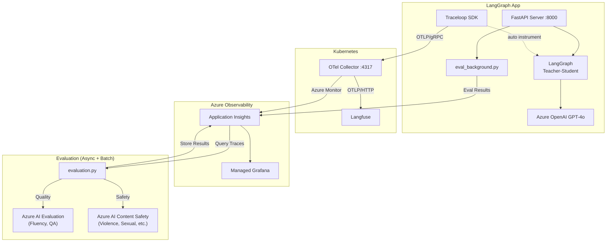

```instructions
# 한국어 (Korean) / English

---

# 🇰🇷 핵심 규칙
- 프로젝트명: otel-langfuse
- LangGraph 기반 Teacher-Student 퀴즈 시스템
- OpenTelemetry + Traceloop을 통한 LLM observability
- Azure AI Evaluation SDK (품질) + Azure AI Content Safety (안전성)를 통한 자동 평가
- FastAPI를 사용하여 웹 서버 구축
- Azure OpenAI (GPT-4o) 사용

## Architecture


## 프로젝트 구조
```
otel-langfuse/
├── main.py              # FastAPI 서버 + OpenTelemetry 초기화
├── graph.py             # LangGraph 워크플로우 (Teacher-Student 퀴즈)
├── eval_background.py   # 비동기 백그라운드 평가 (요청마다 자동 실행)
├── evaluation.py        # Azure AI Evaluation 배치 파이프라인
├── config.py            # 환경설정 로드 (.env)
├── pyproject.toml       # Python 의존성 (uv)
├── .env                 # 환경변수 (git ignore)
├── evaluation_results/  # 평가 결과 저장 디렉토리
│   ├── evaluation_data.jsonl
│   ├── quality_evaluation_result.json
│   ├── safety_evaluation_result.json
│   └── evaluation_metrics.json
├── templates/
│   └── index.html       # 웹 UI
├── static/
│   └── style.css        # 스타일시트
└── k8s/
    ├── langfuse-values.yaml           # Langfuse Helm values
    ├── otel-collector-values.yaml     # OTel Collector Helm values
    └── azure-grafana-langgraph.json   # Azure Managed Grafana 대시보드 (v2)
```

## 주요 기술 스택
- **LangGraph**: Multi-Agent 워크플로우
- **LangChain OpenAI**: Azure OpenAI 연동
- **Traceloop SDK**: LLM input/output 자동 계측
- **OpenTelemetry**: 분산 트레이싱
- **Azure AI Evaluation SDK**: 품질 평가 (Fluency, QA)
- **Azure AI Content Safety**: 안전성 평가 (Violence, Sexual, SelfHarm, Hate)
- **FastAPI**: 웹 프레임워크

## 환경변수 (.env)
```bash
# Azure OpenAI
AZURE_OPENAI_ENDPOINT=https://your-endpoint.openai.azure.com/
AZURE_OPENAI_API_KEY=your-api-key
AZURE_OPENAI_DEPLOYMENT_NAME=gpt-4o
AZURE_OPENAI_API_VERSION=2024-08-01-preview

# OpenTelemetry
OTEL_EXPORTER_OTLP_ENDPOINT=http://20.214.217.93:4317

# Application Insights (Evaluation 데이터 쿼리용)
APP_INSIGHTS_WORKSPACE_ID=your-workspace-id
APP_INSIGHTS_CONNECTION_STRING=InstrumentationKey=...

# Azure AI Content Safety (안전성 평가용)
AZURE_CONTENT_SAFETY_ENDPOINT=https://your-endpoint.cognitiveservices.azure.com/
AZURE_CONTENT_SAFETY_KEY=your-key
```

## 개발환경
- Python 3.10 이상
- uv 패키지 매니저 사용
- 의존성 설치: `uv sync`
- 서버 실행: `.\.venv\Scripts\Activate.ps1; python main.py`
- 배치 평가 실행: `uv run python evaluation.py --hours 24 --limit 100`
- 실시간 평가: 서버 실행 시 매 요청마다 비동기 자동 실행 (eval_background.py)

## Evaluation 평가 항목
- **품질 평가** (Azure AI Evaluation SDK)
  - Fluency: 응답의 유창성 (1-5점)
  - QA: Coherence, Relevance, Groundedness
- **안전성 평가** (Azure AI Content Safety)
  - Violence: 폭력성 (0-6점, 0=안전)
  - Sexual: 성적 콘텐츠
  - SelfHarm: 자해 관련
  - HateUnfairness: 혐오/차별

## Grafana 대시보드 패널
1. **Quality Evaluation Scores**: Fluency, Coherence, Relevance, Groundedness
2. **Safety Evaluation Scores**: Violence, Sexual, SelfHarm, HateUnfairness
3. **Quality Score Trends**: 시간별 품질 점수 추이
4. **Safety Score Trends**: 시간별 안전성 점수 추이
5. **Evaluation Results Detail**: 개별 평가 결과 테이블

## 대화 규칙
- 반드시 한국어만 사용
- 이모지 최소화
- 완료시 "완료" 라고 대답

---

# 🇺🇸 Core Rules
- Project Name: otel-langfuse
- LangGraph-based Teacher-Student Quiz System
- LLM observability via OpenTelemetry + Traceloop
- Automated evaluation with Azure AI Evaluation SDK (Quality) + Azure AI Content Safety (Safety)
- Web server built with FastAPI
- Uses Azure OpenAI (GPT-4o)

## Architecture


## Project Structure
```
otel-langfuse/
├── main.py              # FastAPI server + OpenTelemetry initialization
├── graph.py             # LangGraph workflow (Teacher-Student Quiz)
├── eval_background.py   # Async background evaluation (auto per request)
├── evaluation.py        # Azure AI Evaluation batch pipeline
├── config.py            # Configuration loader (.env)
├── pyproject.toml       # Python dependencies (uv)
├── .env                 # Environment variables (git ignored)
├── evaluation_results/  # Evaluation results directory
│   ├── evaluation_data.jsonl
│   ├── quality_evaluation_result.json
│   ├── safety_evaluation_result.json
│   └── evaluation_metrics.json
├── templates/
│   └── index.html       # Web UI
├── static/
│   └── style.css        # Stylesheet
└── k8s/
    ├── langfuse-values.yaml           # Langfuse Helm values
    ├── otel-collector-values.yaml     # OTel Collector Helm values
    └── azure-grafana-langgraph.json   # Azure Managed Grafana dashboard (v2)
```

## Tech Stack
- **LangGraph**: Multi-Agent workflow
- **LangChain OpenAI**: Azure OpenAI integration
- **Traceloop SDK**: LLM input/output auto-instrumentation
- **OpenTelemetry**: Distributed tracing
- **Azure AI Evaluation SDK**: Quality evaluation (Fluency, QA)
- **Azure AI Content Safety**: Safety evaluation (Violence, Sexual, SelfHarm, Hate)
- **FastAPI**: Web framework

## Environment Variables (.env)
```bash
# Azure OpenAI
AZURE_OPENAI_ENDPOINT=https://your-endpoint.openai.azure.com/
AZURE_OPENAI_API_KEY=your-api-key
AZURE_OPENAI_DEPLOYMENT_NAME=gpt-4o
AZURE_OPENAI_API_VERSION=2024-08-01-preview

# OpenTelemetry
OTEL_EXPORTER_OTLP_ENDPOINT=http://20.214.217.93:4317

# Application Insights (for Evaluation data query)
APP_INSIGHTS_WORKSPACE_ID=your-workspace-id
APP_INSIGHTS_CONNECTION_STRING=InstrumentationKey=...

# Azure AI Content Safety (for Safety evaluation)
AZURE_CONTENT_SAFETY_ENDPOINT=https://your-endpoint.cognitiveservices.azure.com/
AZURE_CONTENT_SAFETY_KEY=your-key
```

## Development
- Python 3.10+
- Use uv package manager
- Install dependencies: `uv sync`
- Run server: `.\.venv\Scripts\Activate.ps1; python main.py`
- Run batch evaluation: `uv run python evaluation.py --hours 24 --limit 100`
- Real-time evaluation: Auto-runs per request when server is running (eval_background.py)

## Evaluation Metrics
- **Quality Evaluation** (Azure AI Evaluation SDK)
  - Fluency: Response fluency (1-5 score)
  - QA: Coherence, Relevance, Groundedness
- **Safety Evaluation** (Azure AI Content Safety)
  - Violence: Violence level (0-6, 0=safe)
  - Sexual: Sexual content
  - SelfHarm: Self-harm related
  - HateUnfairness: Hate/discrimination

## Grafana Dashboard Panels
1. **Quality Evaluation Scores**: Fluency, Coherence, Relevance, Groundedness
2. **Safety Evaluation Scores**: Violence, Sexual, SelfHarm, HateUnfairness
3. **Quality Score Trends**: Quality score trends over time
4. **Safety Score Trends**: Safety score trends over time
5. **Evaluation Results Detail**: Individual evaluation results table

## Conversation Rules
- Use English for global presentation
- Minimize emojis
- Reply "Done" when completed
```


