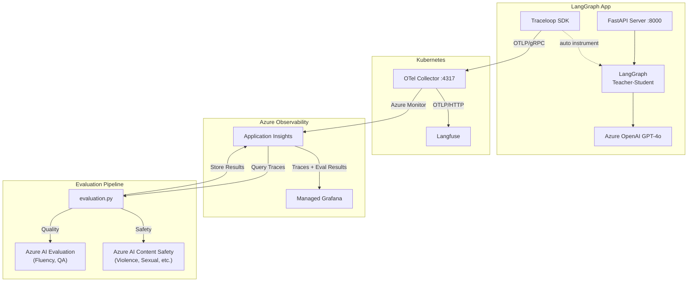

# Agent Observability Deep Dive

---

## Agenda

| # | Topic | Time |
|---|-------|------|
| 1 | Why LLM Observability? | 3 min |
| 2 | Demo App: Teacher-Student Quiz | 3 min |
| 3 | Architecture Deep Dive | 8 min |
| 4 | Code Walkthrough | 6 min |
| 5 | Live Demo | 5 min |
| 6 | Q&A | 5 min |

(Welcome everyone. Today I'll walk you through how we built end-to-end observability for an LLM agent application using OpenTelemetry, Langfuse, and Azure services. The session is about 30 minutes including Q&A.)

---

## 1. Why LLM Observability?

### The Problem

LLM-based apps are fundamentally different from traditional apps:

- **Non-deterministic output**: Same input, different response every time
- **Multi-Agent complexity**: Agent call chains are a black box
- **Hard to measure quality**: How do you quantify "did it work well?"
- **Cost & performance tracking**: Token usage and latency need monitoring
- **Safety**: Must automatically detect harmful content generation

(So why do we even need observability specifically for LLMs? Traditional APM tools track HTTP status codes and latency, but they can't tell you if your agent gave a good answer. LLM apps are non-deterministic — the same prompt can produce completely different outputs. When you chain multiple agents together, it becomes a black box. And you need to track token costs, response quality, and safety all at once.)

### What This Project Solves

```
"We built an LLM app... but is it actually working well?"
                    ↓
    [Tracing] + [Dashboard] + [Automated Evaluation]
                    ↓
       "Here are the numbers."
```

| Aspect | How | Tool |
|--------|-----|------|
| **Tracing** | Auto-capture LLM input/output | Traceloop SDK + OTel Collector |
| **Visualization** | Real-time dashboards | Langfuse + Azure Grafana |
| **Quality** | Auto-evaluate response quality | Azure AI Evaluation SDK |
| **Safety** | Auto-detect harmful content | Azure AI Content Safety |

(This project answers that question with three pillars: tracing to capture what happened, dashboards to visualize it, and automated evaluation to score it. Let me show you how each piece fits together.)

---

## 2. Demo App: Teacher-Student Quiz

### LangGraph Multi-Agent Structure

```
User input: "medium math"

  ┌─────────┐     ┌─────────────────┐     ┌─────────────────┐     ┌─────────────────┐
  │  Setup   │────▶│ Teacher Question│────▶│ Student Answer  │────▶│ Teacher Evaluate│
  │(difficulty│     │ (creates quiz)  │     │ (attempts solve)│     │ (grades answer) │
  │ & subject)│     └─────────────────┘     └─────────────────┘     └─────────────────┘
  └─────────┘           GPT-4o                  GPT-4o                  GPT-4o
```

(Before diving into the observability stack, let me briefly introduce the demo app. It's a multi-agent quiz system built with LangGraph. There are four nodes. Setup parses the user's difficulty and subject. Then Teacher creates a question, Student attempts to answer, and Teacher evaluates the result. Each of the three LLM nodes makes a separate GPT-4o call.)

### LangGraph Workflow (graph.py)

```python
# 4 nodes with conditional edges
graph_builder = StateGraph(State)

graph_builder.add_node("setup", setup_handler)                # Parse difficulty/subject
graph_builder.add_node("teacher_question", teacher_question)  # Create question
graph_builder.add_node("student_answer", student_answer)      # Attempt answer
graph_builder.add_node("teacher_evaluate", teacher_evaluate)  # Evaluate answer

graph_builder.add_edge(START, "setup")
graph_builder.add_conditional_edges("setup", route_after_setup, {
    "teacher_question": "teacher_question",
    "end": END,
})
graph_builder.add_edge("teacher_question", "student_answer")
graph_builder.add_edge("student_answer", "teacher_evaluate")
graph_builder.add_edge("teacher_evaluate", END)
```

### Quiz Phase Flow

```
SETUP → QUESTIONING → ANSWERING → EVALUATING → COMPLETE
  ↑                                                 │
  └──────────────── "reset" ────────────────────────┘
```

(Here's the actual graph code. The key thing to notice is the conditional edge after setup — if the user didn't provide valid difficulty and subject, we loop back. Otherwise, it flows linearly through three LLM calls. This is a simple but realistic multi-agent pattern.)

### Live Demo Points
- Open http://localhost:8000
- Enter "medium math" and watch Teacher/Student conversation
- Observe SSE streaming with per-node real-time responses

---

## 3. Architecture Deep Dive

### Conceptual Architecture

```
                          ┌───────────────────────────────────────────┐
                          │          Kubernetes Cluster               │
                          │                                           │
┌─────────────────┐       │  ┌──────────────┐     ┌──────────────┐  │
│   LangGraph     │ OTLP  │  │    OTel      │OTLP │   Langfuse   │  │
│   FastAPI App   │─gRPC──┼─▶│  Collector   │─HTTP┼─▶│  (Web UI)  │  │
│  + Traceloop    │       │  │              │     │  └──────────────┘  │
└─────────────────┘       │  │              │     │                    │
   Azure OpenAI           │  │              │     │                    │
     GPT-4o               │  └──────┬───────┘     │                    │
                          │         │Azure Monitor │                    │
                          └─────────┼──────────────┘                    │
                                    ▼                                    
                          ┌──────────────────┐                          
                          │ Azure Application │◀──── evaluation.py      
                          │     Insights      │      (stores results)   
                          └────────┬─────────┘                          
                                   │ KQL Query                          
                                   ▼                                    
                          ┌──────────────────┐                          
                          │  Azure Managed   │                          
                          │     Grafana      │                          
                          └──────────────────┘                          
```

(Now here's the full architecture. The app sends traces via OTLP gRPC to the OpenTelemetry Collector running in Kubernetes. The Collector fans out to two destinations: Langfuse via OTLP HTTP for the LLM-specific trace UI, and Azure Application Insights via the Azure Monitor exporter for KQL-queryable storage. Then separately, the evaluation pipeline queries traces from App Insights, runs quality and safety evaluations, and writes the scores back to App Insights as custom events. Grafana reads both traces and evaluation results from App Insights via KQL.)

### Logical Architecture



(This is the same architecture as a logical diagram showing the four subsystems. On the left, the LangGraph App where FastAPI drives the agent workflow and Traceloop auto-instruments it. In the middle, Kubernetes hosts both the OTel Collector and Langfuse. On the right, Azure services — App Insights and Grafana. And at the bottom, the evaluation pipeline that closes the loop by reading traces and writing scores back. Notice how App Insights sits at the center, receiving data from both the Collector and the evaluation pipeline, and feeding Grafana.)

### Data Flow Detail

| Step | From | To | Protocol | Data |
|------|------|----|----------|------|
| 1 | FastAPI App | OTel Collector | OTLP/gRPC (:4317) | LLM traces (input/output/tokens) |
| 2 | OTel Collector | Langfuse | OTLP/HTTP | Same traces → LLM-specific UI |
| 3 | OTel Collector | App Insights | Azure Monitor exporter | Same traces → KQL queryable |
| 4 | evaluation.py | App Insights | opencensus (customEvents) | Evaluation scores (quality + safety) |
| 5 | App Insights | Grafana | KQL query | Traces + evaluation results visualization |

(Let me break down the data flow step by step. Step 1: the app sends OTLP gRPC to the Collector. Steps 2 and 3 happen in parallel — the Collector exports the same trace data to both Langfuse and App Insights using different exporters. Step 4 is the evaluation pipeline writing scores back. And Step 5 is Grafana pulling everything together via KQL queries.)

### Why Use OTel Collector?

**Without Collector (direct export)**
```
App → Langfuse     (needs SDK A)
App → App Insights (needs SDK B)
App → Other backend (needs SDK C)
```

**With Collector (fan-out)**
```
App → OTel Collector → Langfuse
                     → App Insights
                     → (future backends)
```

- Add/remove backends without changing app code
- Batch processing and memory limits handled by Collector
- App only needs to know OTLP

(A common question is: why not export directly from the app? The answer is the Collector acts as a universal router. Your app speaks one protocol — OTLP — and the Collector handles fan-out. Want to add a new observability backend? Just update the Collector config. No app code changes needed. It also handles batching and memory limits so your app doesn't have to.)

### OTel Collector Config (k8s/otel-collector-values.yaml)

```yaml
config:
  receivers:
    otlp:                          # Receive OTLP from app
      protocols:
        grpc:
          endpoint: 0.0.0.0:4317

  exporters:
    otlphttp/langfuse:             # Forward to Langfuse
      endpoint: "http://langfuse-web:3000/api/public/otel"
    azuremonitor:                  # Forward to App Insights
      connection_string: "InstrumentationKey=..."

  service:
    pipelines:
      traces:
        receivers: [otlp]
        processors: [memory_limiter, batch]
        exporters: [otlphttp/langfuse, azuremonitor]  # Fan-out!
```

(Here's the actual Collector config. The pipeline definition at the bottom is the key part — one receiver, two exporters. That's how the fan-out works. Note we use the contrib image because the Azure Monitor exporter is not in the core distribution.)

---

## 4. Code Walkthrough

### 4-1. Traceloop Initialization (main.py)

```python
from traceloop.sdk import Traceloop
from opentelemetry.exporter.otlp.proto.grpc.trace_exporter import OTLPSpanExporter

# OTLP Exporter → sends to OTel Collector
otlp_exporter = OTLPSpanExporter(
    endpoint=OTEL_EXPORTER_OTLP_ENDPOINT,  # "http://collector:4317"
    insecure=True,
)

# Initialize Traceloop → auto-instruments LangChain/OpenAI
Traceloop.init(
    app_name="teacher-student-quiz",
    disable_batch=False,
    exporter=otlp_exporter,
)
```

**Key point**: Traceloop SDK auto-instruments LangChain/OpenAI calls.
Without any code changes, `gen_ai.prompt`, `gen_ai.completion`, and `llm.usage.total_tokens` are captured automatically.

(This is the instrumentation setup. Just three lines of meaningful code. We create an OTLP exporter pointing to the Collector, and pass it to Traceloop.init. That's it. From this point, every LangChain and OpenAI call is automatically traced — prompts, completions, token counts, latency — all captured without touching any business logic.)

### 4-2. Manual Span Enrichment (main.py - chat_stream)

```python
# Add business metadata on top of auto-instrumentation
with tracer.start_as_current_span("chat_stream") as span:
    # Langfuse-recognized attribute keys
    span.set_attribute("langfuse.trace.name", "langgraph-session")
    span.set_attribute("langfuse.session.id", session_id)
    span.set_attribute("langfuse.trace.input", user_input)

    # Run LangGraph
    async for event in graph.astream(invoke_state, config=config, stream_mode="updates"):
        # ... streaming logic ...

    # Record final output
    span.set_attribute("langfuse.trace.output", final_output)
```

**Key point**: Setting `langfuse.*` prefix attributes enables trace/session grouping in the Langfuse UI.

(Auto-instrumentation captures the LLM calls, but we also want business context — which session, what user input, what final output. We do that by creating a manual span and setting Langfuse-specific attributes. The `langfuse.session.id` groups all traces from the same user session together in the Langfuse UI.)

### 4-3. Evaluation Pipeline (evaluation.py)

```python
# Step 1: Query traces from App Insights (KQL)
traces = query_traces_from_app_insights(hours=24, limit=100)
#   → Extracts gen_ai.prompt, gen_ai.completion from AppDependencies table

# Step 2: Quality evaluation (Azure AI Evaluation SDK)
result = evaluate(
    data=str(data_path),
    evaluators={
        "fluency": FluencyEvaluator(model_config),
        "coherence": CoherenceEvaluator(model_config),
        "relevance": RelevanceEvaluator(model_config),
        "groundedness": GroundednessEvaluator(model_config),
    },
)

# Step 3: Safety evaluation (Azure AI Content Safety)
client = ContentSafetyClient(endpoint, credential)
response = client.analyze_text(AnalyzeTextOptions(text=text))
# → Violence, Hate, Sexual, SelfHarm categories scored 0-6

# Step 4: Send results to App Insights as customEvents
logger.info("evaluation_result", extra={"custom_dimensions": event_properties})
# → Queryable via KQL in Grafana
```

(The evaluation pipeline is a separate batch process. Step 1: it queries App Insights for recent LLM traces using KQL. Step 2: runs four quality evaluators — fluency, coherence, relevance, and groundedness — each scoring 1 to 5. Step 3: runs Azure Content Safety to check for violence, hate, sexual content, and self-harm — scored 0 to 6 where 0 is safe. Step 4: writes all scores back to App Insights as custom events so Grafana can display them.)

### 4-4. Evaluation ↔ Observability Connection

```
                        App Insights
                    ┌───────────────────┐
OTel Collector ────▶│ AppDependencies   │ ← LLM traces (auto)
                    │  (traces storage)  │
                    │                   │      ┌──────────────────┐
evaluation.py ─────▶│ customEvents      │─────▶│ Grafana Dashboard│
  ↑  query (KQL)    │  (eval results)   │      │  - Quality Scores│
  └─────────────────│                   │      │  - Safety Scores │
                    └───────────────────┘      │  - Trends        │
                                               └──────────────────┘
```

(This diagram shows the key insight: App Insights serves as the central data store for both traces and evaluation results. The OTel Collector writes traces to the AppDependencies table. The evaluation pipeline reads from that table and writes scored results to the customEvents table. Grafana then queries both tables for a unified dashboard.)

---

## 5. Live Demo

### Demo 1: Run Quiz App & Observe Tracing

```bash
# Start server
uv run main.py

# Open browser
# http://localhost:8000
# Enter "medium math"
```

**What to observe:**
- Teacher → Student → Teacher three-step execution
- SSE streaming with per-node real-time responses

(Let me switch to the browser and show you the app running. I'll type "medium math" and you'll see the three agents execute in sequence. Notice how each node streams its response in real-time via Server-Sent Events.)

### Demo 2: Traces in Langfuse

**What to observe:**
- Click the `langgraph-session` trace
- Full LLM input/output for each call
- Token usage and latency
- Session-grouped conversation flow

(Now let's switch to Langfuse. Here you can see the trace for that quiz session. Click into it and you'll see each individual LLM call — the exact prompt, the exact completion, how many tokens were used, and how long it took. All of this was captured automatically by Traceloop.)

### Demo 3: Grafana Dashboard

**Grafana panels:**

| Panel | Data Source | Description |
|-------|------------|-------------|
| LangGraph Agent Summary | AppDependencies | Total traces, LLM calls, tokens, success rate |
| Agent Execution Trends | AppDependencies | Execution trends over time (success/failure) |
| LLM Call Trends | AppDependencies | LLM call counts + token usage over time |
| Node Performance | AppDependencies | Per-node avg latency and call counts |
| Quality Evaluation Scores | customEvents | Fluency, Coherence, Relevance, Groundedness |
| Safety Evaluation Scores | customEvents | Violence, Sexual, SelfHarm, HateUnfairness |
| Score Trends | customEvents | Quality/safety score trends over time |

(And here's the Grafana dashboard. The top row shows operational metrics from traces — total executions, LLM calls, token counts. The middle section shows node-level performance. The bottom section shows evaluation scores from the batch pipeline. Everything is powered by KQL queries against App Insights.)

### Demo 4: Run Evaluation Pipeline

```bash
# Evaluate traces from the last 24 hours
uv run python evaluation.py --hours 24 --limit 100
```

**What to observe:**
- Trace query from App Insights
- Quality scores (1-5 scale)
- Safety scores (0-6 scale, 0 = safe)
- Results appearing in Grafana

(Finally, let me run the evaluation pipeline. It will query the last 24 hours of traces, score them for quality and safety, and push the results back to App Insights. After a minute or two, you'll see the scores update in the Grafana dashboard.)

---

## 6. Tech Stack Summary

| Layer | Technology | Role |
|-------|-----------|------|
| **Application** | FastAPI + LangGraph | Web server + Multi-Agent workflow |
| **LLM** | Azure OpenAI GPT-4o | Brain for Teacher/Student agents |
| **Auto-Instrumentation** | Traceloop SDK | Auto-capture LangChain/OpenAI calls |
| **Trace Transport** | OTel Collector (K8s) | OTLP receive → fan-out to Langfuse + App Insights |
| **LLM Observability** | Langfuse (K8s) | LLM-specific trace UI |
| **Trace Storage** | Azure Application Insights | General-purpose trace store + KQL queries |
| **Dashboard** | Azure Managed Grafana | Custom dashboards (KQL-based) |
| **Quality Eval** | Azure AI Evaluation SDK | Fluency, Coherence, Relevance, Groundedness |
| **Safety Eval** | Azure AI Content Safety | Violence, Sexual, SelfHarm, Hate detection |

(Here's the full tech stack at a glance. The left column shows the architectural layer, and each has a specific tool. The key design choice is using OTel Collector as the routing layer — it decouples the app from the observability backends.)

---

## Key Takeaways

1. **OpenTelemetry works for LLM apps too**
   - Traceloop SDK auto-instruments LangChain/OpenAI
   - Reuse existing OTel infrastructure (Collector, App Insights, Grafana)

2. **OTel Collector = universal trace router**
   - Fan-out to multiple backends without app code changes
   - Langfuse (LLM-specific) + App Insights (general-purpose) simultaneously

3. **Observability + Evaluation = complete monitoring**
   - Tracing alone is not enough → automated quality/safety evaluation is essential
   - Store evaluation results back in App Insights → unified view in Grafana

4. **Production considerations**
   - Set `OTEL_ATTRIBUTE_VALUE_LENGTH_LIMIT` higher (LLM messages are long)
   - Enable `TRACELOOP_TRACE_CONTENT=true` (disabled by default)
   - Run evaluation as a batch job (CI/CD or cron)

(To wrap up, four takeaways. First, OpenTelemetry is not just for microservices — it works great for LLM apps with Traceloop. Second, the OTel Collector is the key architectural piece that enables flexible fan-out. Third, tracing alone doesn't tell you if your agent is good — you need automated evaluation. And fourth, there are a few production gotchas, especially around attribute length limits and content capture settings. Thank you, and I'm happy to take questions.)

---

## Appendix A: Project Structure

```
otel-langfuse/
├── main.py              # FastAPI server + OpenTelemetry initialization
├── graph.py             # LangGraph workflow (Teacher-Student Quiz)
├── evaluation.py        # Azure AI Evaluation automation pipeline
├── config.py            # Configuration loader (.env)
├── pyproject.toml       # Python dependencies (uv)
├── .env                 # Environment variables (git ignored)
├── evaluation_results/  # Evaluation results directory
│   ├── evaluation_data.jsonl
│   ├── quality_evaluation_result.json
│   ├── safety_evaluation_result.json
│   └── evaluation_metrics.json
├── templates/
│   └── index.html       # Web UI
├── static/
│   └── style.css        # Stylesheet
└── k8s/
    ├── langfuse-values.yaml           # Langfuse Helm values
    ├── otel-collector-values.yaml     # OTel Collector Helm values
    └── azure-grafana-langgraph.json   # Azure Managed Grafana dashboard (v2)
```

(For anyone who wants to explore the repo later, here's the full project structure. The four Python files at the top are the core — main.py for the server, graph.py for the agent workflow, evaluation.py for the evaluation pipeline, and config.py for environment loading. The k8s folder has all the Kubernetes deployment configs.)

---

## Appendix B: Environment Variables

| Variable | Description |
|----------|-------------|
| `AZURE_OPENAI_ENDPOINT` | Azure OpenAI endpoint URL |
| `AZURE_OPENAI_API_KEY` | Azure OpenAI API key |
| `AZURE_OPENAI_DEPLOYMENT_NAME` | Deployment name (e.g., `gpt-4o`) |
| `AZURE_OPENAI_API_VERSION` | API version (e.g., `2024-08-01-preview`) |
| `OTEL_EXPORTER_OTLP_ENDPOINT` | OTel Collector gRPC endpoint (e.g., `http://<ip>:4317`) |
| `APP_INSIGHTS_WORKSPACE_ID` | Log Analytics workspace ID (for KQL queries) |
| `APP_INSIGHTS_CONNECTION_STRING` | App Insights connection string |
| `AZURE_CONTENT_SAFETY_ENDPOINT` | Azure AI Content Safety endpoint |
| `AZURE_CONTENT_SAFETY_KEY` | Azure AI Content Safety API key |

(If you want to set this up in your own environment, these are all the environment variables you need. Copy the `.env.example`, fill in your values, and you're good to go.)

---

## Appendix C: Quick Start

```bash
# 1. Install dependencies
uv sync

# 2. Set up environment variables
cp .env.example .env
# Edit .env with your values

# 3. Run the server
.\.venv\Scripts\Activate.ps1
python main.py
# → http://localhost:8000

# 4. Run evaluation pipeline
uv run python evaluation.py --hours 24 --limit 100
```

**Requirements**: Python 3.10+, [uv](https://github.com/astral-sh/uv) package manager

(Three commands to get started: uv sync to install, activate and run main.py for the server, and evaluation.py for the batch evaluation. The repo uses uv as the package manager — if you haven't tried it, it's significantly faster than pip.)

---

## Appendix D: Evaluation Metrics Reference

### Quality Evaluation (Azure AI Evaluation SDK)

| Metric | Scale | Description |
|--------|-------|-------------|
| Fluency | 1-5 | Linguistic quality and readability |
| Coherence | 1-5 | Logical consistency and flow |
| Relevance | 1-5 | How well the response addresses the query |
| Groundedness | 1-5 | Factual accuracy based on provided context |

### Safety Evaluation (Azure AI Content Safety)

| Category | Scale | Description |
|----------|-------|-------------|
| Violence | 0-6 | Violence-related content (0 = safe) |
| Sexual | 0-6 | Sexual content (0 = safe) |
| SelfHarm | 0-6 | Self-harm related content (0 = safe) |
| HateUnfairness | 0-6 | Hate speech or discrimination (0 = safe) |

(For reference, here are the exact evaluation metrics. Quality scores use a 1-to-5 scale where 5 is best. Safety scores use a 0-to-6 scale where 0 means safe. In our Grafana dashboard, we track all of these over time so you can spot regressions immediately.)

---

## References

- [OpenTelemetry](https://opentelemetry.io/)
- [Traceloop SDK](https://github.com/traceloop/openllmetry)
- [LangGraph](https://langchain-ai.github.io/langgraph/)
- [Langfuse](https://langfuse.com/)
- [Azure AI Evaluation SDK](https://learn.microsoft.com/azure/ai-studio/how-to/develop/evaluate-sdk)
- [Azure AI Content Safety](https://learn.microsoft.com/azure/ai-services/content-safety/)
- [Azure Managed Grafana](https://learn.microsoft.com/azure/managed-grafana/)
