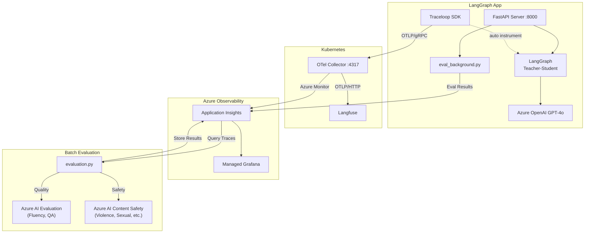

# Agent Observability Deep Dive

---

## Agenda

| # | Topic | Time |
|---|-------|------|
| 1 | Why LLM Observability? | 3 min |
| 2 | Demo App: Teacher-Student Quiz | 3 min |
| 3 | Architecture Deep Dive | 8 min |
| 4 | Code Walkthrough | 6 min |
| 5 | Live Demo | 5 min |
| 6 | Q&A | 5 min |

(Thanks everyone for joining. I'm excited to share what we've been building — a complete end-to-end observability story for LLM agent applications, combining OpenTelemetry, Langfuse, and Azure services into a single cohesive stack. We'll cover the why, the how, and a live demo in about 30 minutes, with time for Q&A at the end. Let's dive in.)

---

## 1. Why LLM Observability?

### The Problem

LLM-based apps are fundamentally different from traditional apps:

- **Non-deterministic output**: Same input, different response every time
- **Multi-Agent complexity**: Agent call chains are a black box
- **Hard to measure quality**: How do you quantify "did it work well?"
- **Cost & performance tracking**: Token usage and latency need monitoring
- **Safety**: Must automatically detect harmful content generation

(So let's start with the fundamental question — why do we need a different observability approach for LLM applications? We all know traditional APM. It tracks HTTP status codes, latency, error rates — and it does that really well. But here's the gap: a 200 OK tells you nothing about whether your agent actually gave a good answer. LLM apps are non-deterministic by nature — the same prompt produces different outputs every time. When you chain multiple agents together, the execution becomes a black box. And on top of that, you need to track token costs, measure response quality, and ensure content safety — all simultaneously. This is a fundamentally different monitoring challenge.)

### What This Project Solves

```
"We built an LLM app... but is it actually working well?"
                    ↓
    [Tracing] + [Dashboard] + [Automated Evaluation]
                    ↓
       "Here are the numbers."
```

| Aspect | How | Tool |
|--------|-----|------|
| **Tracing** | Auto-capture LLM input/output | Traceloop SDK + OTel Collector |
| **Visualization** | Real-time dashboards | Langfuse + Azure Grafana |
| **Quality** | Auto-evaluate response quality | Azure AI Evaluation SDK |
| **Safety** | Auto-detect harmful content | Azure AI Content Safety |

(What we built addresses this with three pillars. First, tracing — to capture exactly what happened at the LLM call level. Second, dashboards — to visualize operational and quality metrics in real time. And third, automated evaluation — to programmatically score every response for quality and safety. The key insight here is that all three pillars feed into a unified Azure-native observability stack. Let me walk you through how each piece fits together.)

---

## 2. Demo App: Teacher-Student Quiz

### LangGraph Multi-Agent Structure

```
User input: "medium math"

  ┌─────────┐     ┌─────────────────┐     ┌─────────────────┐     ┌─────────────────┐
  │  Setup   │────▶│ Teacher Question│────▶│ Student Answer  │────▶│ Teacher Evaluate│
  │(difficulty│     │ (creates quiz)  │     │ (attempts solve)│     │ (grades answer) │
  │ & subject)│     └─────────────────┘     └─────────────────┘     └─────────────────┘
  └─────────┘           GPT-4o                  GPT-4o                  GPT-4o
```

(Before we get into the observability stack, let me set the stage with the demo application. We built a multi-agent quiz system using LangGraph — it's intentionally simple, but representative of real-world agent patterns. There are four nodes in the graph. Setup parses the user's requested difficulty and subject. Then the Teacher agent creates a question, the Student agent attempts to answer it, and the Teacher evaluates the result. The important thing to note is that three of these nodes each make an independent GPT-4o call — so per user request, we're looking at three separate LLM invocations that we need to trace and evaluate.)

### LangGraph Workflow (graph.py)

```python
# 4 nodes with conditional edges
graph_builder = StateGraph(State)

graph_builder.add_node("setup", setup_handler)                # Parse difficulty/subject
graph_builder.add_node("teacher_question", teacher_question)  # Create question
graph_builder.add_node("student_answer", student_answer)      # Attempt answer
graph_builder.add_node("teacher_evaluate", teacher_evaluate)  # Evaluate answer

graph_builder.add_edge(START, "setup")
graph_builder.add_conditional_edges("setup", route_after_setup, {
    "teacher_question": "teacher_question",
    "end": END,
})
graph_builder.add_edge("teacher_question", "student_answer")
graph_builder.add_edge("student_answer", "teacher_evaluate")
graph_builder.add_edge("teacher_evaluate", END)
```

### Quiz Phase Flow

```
SETUP → QUESTIONING → ANSWERING → EVALUATING → COMPLETE
  ↑                                                 │
  └──────────────── "reset" ────────────────────────┘
```

(Here's the actual LangGraph code — and it's remarkably concise. The key design point is the conditional edge after setup. If the user didn't provide valid difficulty and subject, we route back to END and prompt them again. Otherwise, it flows linearly: Teacher asks, Student answers, Teacher evaluates. It's a simple but realistic pattern — and more importantly, it gives us a great testbed for observability because we can trace each node independently and evaluate the quality of each LLM interaction.)

### Live Demo Points
- Open http://localhost:8000
- Enter "medium math" and watch Teacher/Student conversation
- Observe SSE streaming with per-node real-time responses

---

## 3. Architecture Deep Dive

### Conceptual Architecture

```
                        ┌──────────────────────────────────────────────┐
                        │            Kubernetes Cluster                │
                        │                                              │
┌─────────────────┐     │  ┌──────────────┐  OTLP   ┌──────────────┐   │
│   LangGraph     │OTLP │  │              │──HTTP──▶│   Langfuse  │   │
│   FastAPI App   │gRPC─┼──▶OTel Collector│         │   (Web UI)  │   │
│  + Traceloop    │     │  │              │         └──────────────┘   │
└─────────────────┘     │  └──────┬───────┘                            │
   Azure OpenAI         │         │ Azure Monitor                      │
     GPT-4o             └─────────┼────────────────────────────────────┘
                                  ▼
                        ┌────────────────────┐
                        │ Azure Application  │◀──── evaluation.py
                        │     Insights       │       (stores results)
                        └────────┬───────────┘
                                 │ KQL Query
                                 ▼
                        ┌────────────────────┐
                        │  Azure Managed     │
                        │     Grafana        │
                        └────────────────────┘
```

(Now let's look at the full architecture — this is where it gets interesting. On the left, our FastAPI application sends traces via OTLP gRPC to the OpenTelemetry Collector running in Kubernetes. The Collector is the key routing layer here — it fans out the same trace data to two destinations simultaneously. First, Langfuse via OTLP HTTP, which gives us a purpose-built LLM trace UI with prompt-level visibility. Second, Azure Application Insights via the Azure Monitor exporter, which gives us a KQL-queryable data store that integrates natively with our Azure ecosystem. Then, on a separate path, the evaluation pipeline queries those traces from App Insights, scores them for quality and safety using Azure AI services, and writes the results back to App Insights as custom events. Grafana sits on top, querying everything via KQL for a unified operational dashboard. The beauty of this design is that each component does one thing well, and App Insights acts as the central nervous system connecting tracing and evaluation.)

### Logical Architecture



(This is the same architecture rendered as a logical flow diagram — I think it makes the subsystem boundaries clearer. Four distinct subsystems. Top-left: the LangGraph application, where FastAPI drives the agent workflow and Traceloop auto-instruments every LLM call. Center: the Kubernetes layer hosting the OTel Collector and Langfuse. Right: our Azure observability stack — App Insights and Managed Grafana. And at the bottom: the evaluation pipeline that closes the feedback loop. What I want you to take away from this diagram is the central role of App Insights — it receives trace data from the Collector, receives evaluation scores from both the real-time and batch pipelines, and feeds everything into Grafana. It's the single pane of glass for this entire system.)

### Data Flow Detail

| Step | From | To | Protocol | Data |
|------|------|----|----------|------|
| 1 | FastAPI App | OTel Collector | OTLP/gRPC (:4317) | LLM traces (input/output/tokens) |
| 2 | OTel Collector | Langfuse | OTLP/HTTP | Same traces → LLM-specific UI |
| 3 | OTel Collector | App Insights | Azure Monitor exporter | Same traces → KQL queryable |
| 4 | eval_background.py | App Insights | opencensus (customEvents) | Per-request evaluation scores (quality + safety) |
| 5 | evaluation.py | App Insights | opencensus (customEvents) | Batch evaluation scores (quality + safety) |
| 6 | App Insights | Grafana | KQL query | Traces + evaluation results visualization |

(Let me walk through the data flow step by step — this is important for understanding the end-to-end latency and data freshness characteristics. Step 1: the application emits OTLP gRPC to the Collector — this happens in-process, sub-millisecond overhead. Steps 2 and 3 happen in parallel — the Collector fans out the same trace data to both Langfuse and App Insights using different exporters, so there's no additional latency to the app. Step 4 is where it gets interesting — this is the real-time background evaluation path. Every single chat request triggers eval_background.py, which scores quality and safety in a background thread and writes results to App Insights as custom events. Zero impact on user-facing latency. Step 5 is the batch evaluation pipeline — evaluation.py queries historical traces from App Insights via KQL, runs the same quality and safety evaluations in bulk, and writes aggregated scores back. This is designed for CI/CD or cron-based execution. And Step 6 is Grafana pulling everything together — traces, real-time scores, and batch scores — all via KQL queries for a unified operational dashboard.)

### Why Use OTel Collector?

**Without Collector (direct export)**
```
App → Langfuse     (needs SDK A)
App → App Insights (needs SDK B)
App → Other backend (needs SDK C)
```

**With Collector (fan-out)**
```
App → OTel Collector → Langfuse
                     → App Insights
                     → (future backends)
```

- Add/remove backends without changing app code
- Batch processing and memory limits handled by Collector
- App only needs to know OTLP

(This is a question I get a lot — why introduce the Collector as a middle layer? Why not just export directly from the application? The answer comes down to operational flexibility. With the Collector, your application speaks exactly one protocol — OTLP. That's it. The Collector handles the fan-out, the protocol translation, the batching, the retry logic, and the memory management. Want to add a third observability backend tomorrow? Update a YAML config and redeploy the Collector. Zero application code changes, zero redeployment of your app. This is the same pattern we recommend across Azure — decouple your telemetry pipeline from your application lifecycle.)

### OTel Collector Config (k8s/otel-collector-values.yaml)

```yaml
config:
  receivers:
    otlp:                          # Receive OTLP from app
      protocols:
        grpc:
          endpoint: 0.0.0.0:4317

  exporters:
    otlphttp/langfuse:             # Forward to Langfuse
      endpoint: "http://langfuse-web:3000/api/public/otel"
    azuremonitor:                  # Forward to App Insights
      connection_string: "InstrumentationKey=..."

  service:
    pipelines:
      traces:
        receivers: [otlp]
        processors: [memory_limiter, batch]
        exporters: [otlphttp/langfuse, azuremonitor]  # Fan-out!
```

(Here's the actual Collector configuration — and I want to call your attention to the pipeline definition at the bottom. One receiver, two exporters. That single block is what enables the entire fan-out architecture. The traces pipeline receives OTLP, runs it through memory limiter and batch processors, and exports simultaneously to Langfuse and Azure Monitor. One important note: we use the contrib distribution image because the Azure Monitor exporter is only available in the contrib build, not the core OpenTelemetry Collector.)

---

## 4. Code Walkthrough

### 4-1. Traceloop Initialization (main.py)

```python
from traceloop.sdk import Traceloop
from opentelemetry.exporter.otlp.proto.grpc.trace_exporter import OTLPSpanExporter

# OTLP Exporter → sends to OTel Collector
otlp_exporter = OTLPSpanExporter(
    endpoint=OTEL_EXPORTER_OTLP_ENDPOINT,  # "http://collector:4317"
    insecure=True,
)

# Initialize Traceloop → auto-instruments LangChain/OpenAI
Traceloop.init(
    app_name="teacher-student-quiz",
    disable_batch=False,
    exporter=otlp_exporter,
)
```

**Key point**: Traceloop SDK auto-instruments LangChain/OpenAI calls.
Without any code changes, `gen_ai.prompt`, `gen_ai.completion`, and `llm.usage.total_tokens` are captured automatically.

(Now let's look at the code. This is the entire instrumentation setup — and I think this is one of the most compelling parts. Three lines of meaningful code. We create an OTLP exporter pointing to the Collector, pass it to Traceloop.init, and we're done. From this point forward, every LangChain and OpenAI call in the application is automatically traced. Prompts, completions, token counts, latency — all captured with zero changes to business logic. This is the power of auto-instrumentation. The Traceloop SDK hooks into the LangChain and OpenAI libraries at the framework level, so you get full LLM observability out of the box.)

### 4-2. Manual Span Enrichment (main.py - chat_stream)

```python
# Add business metadata on top of auto-instrumentation
with tracer.start_as_current_span("chat_stream") as span:
    # Langfuse-recognized attribute keys
    span.set_attribute("langfuse.trace.name", "langgraph-session")
    span.set_attribute("langfuse.session.id", session_id)
    span.set_attribute("langfuse.trace.input", user_input)

    # Run LangGraph
    async for event in graph.astream(invoke_state, config=config, stream_mode="updates"):
        # ... streaming logic ...

    # Record final output
    span.set_attribute("langfuse.trace.output", final_output)
```

**Key point**: Setting `langfuse.*` prefix attributes enables trace/session grouping in the Langfuse UI.

(Auto-instrumentation gives us the LLM-level telemetry, but in production you also want business context — which user session is this, what was the original input, what was the final output. We achieve this by creating a manual span and enriching it with Langfuse-recognized attributes. The key here is the attribute naming convention: anything prefixed with `langfuse.` gets special treatment in the Langfuse UI. For example, `langfuse.session.id` groups all traces from the same user session together, giving you a conversation-level view. This is the pattern — auto-instrumentation for the heavy lifting, manual spans for business context.)

### 4-3. Evaluation Pipeline (evaluation.py)

```python
# Step 1: Query traces from App Insights (KQL)
traces = query_traces_from_app_insights(hours=24, limit=100)
#   → Extracts gen_ai.prompt, gen_ai.completion from AppDependencies table

# Step 2: Quality evaluation (Azure AI Evaluation SDK)
result = evaluate(
    data=str(data_path),
    evaluators={
        "fluency": FluencyEvaluator(model_config),
        "coherence": CoherenceEvaluator(model_config),
        "relevance": RelevanceEvaluator(model_config),
        "groundedness": GroundednessEvaluator(model_config),
    },
)

# Step 3: Safety evaluation (Azure AI Content Safety)
client = ContentSafetyClient(endpoint, credential)
response = client.analyze_text(AnalyzeTextOptions(text=text))
# → Violence, Hate, Sexual, SelfHarm categories scored 0-6

# Step 4: Send results to App Insights as customEvents
logger.info("evaluation_result", extra={"custom_dimensions": event_properties})
# → Queryable via KQL in Grafana
```

(The evaluation pipeline is where observability meets quality assurance. It's a four-step batch process. Step 1: query App Insights for recent LLM traces using KQL — we pull the actual prompts and completions from the AppDependencies table. Step 2: run four quality evaluators from the Azure AI Evaluation SDK — fluency, coherence, relevance, and groundedness — each producing a 1-to-5 score. Step 3: run Azure AI Content Safety to analyze every response for violence, hate speech, sexual content, and self-harm — scored on a 0-to-6 scale where 0 is safe. Step 4: write all scores back to App Insights as custom events. This is what closes the loop — now Grafana can show you not just what happened, but how well it performed.)

### 4-4. Real-time Background Evaluation (eval_background.py)

```python
# In main.py — after returning the response to the user:
asyncio.create_task(
    asyncio.to_thread(evaluate_single, user_input, final_output)
)
# → Runs quality + safety evaluation in a background thread
# → Zero impact on response latency
```

```python
# eval_background.py — evaluate_single()
def evaluate_single(query: str, response: str) -> dict:
    # Quality: Fluency, Coherence, Relevance, Groundedness (1-5)
    # Safety: Violence, Sexual, SelfHarm, Hate (0-6)
    # → Send results to App Insights customEvents
    logger.info("evaluation_result", extra={"custom_dimensions": result})
```

**Key point**: Every chat response triggers evaluation automatically. No manual pipeline run needed for near real-time monitoring.

(The batch pipeline is essential for historical analysis, but we asked ourselves — can we get evaluation scores in near real-time? That's what this module does. After the response is returned to the user, we spawn a background thread via asyncio.to_thread that runs the exact same quality and safety evaluations. The critical design choice here is that this is completely non-blocking — the user experiences zero additional latency. The event loop is free, the response has already been sent, and the evaluation runs asynchronously in a separate thread. Results appear in App Insights — and therefore in Grafana — within approximately five minutes. This gives you a continuous quality signal without any manual pipeline execution.)

### 4-5. Evaluation ↔ Observability Connection

```
                        App Insights
                    ┌───────────────────┐
OTel Collector ────▶│ AppDependencies   │ ← LLM traces (auto)
                    │  (traces storage)  │
                    │                   │      ┌──────────────────┐
evaluation.py ─────▶│ customEvents      │─────▶│ Grafana Dashboard│
  ↑  query (KQL)    │  (eval results)   │      │  - Quality Scores│
  └─────────────────│                   │      │  - Safety Scores │
                    └───────────────────┘      │  - Trends        │
                                               └──────────────────┘
```

(This diagram captures the key architectural insight of the entire system. App Insights serves as the central data store for both operational traces and evaluation results. The OTel Collector writes LLM traces to the AppDependencies table — that's automatic. The evaluation pipeline reads from that table via KQL, runs its scoring logic, and writes the results back to the customEvents table. Grafana then queries both tables to render a unified dashboard. Two different data flows, one data store, one dashboard. That's the simplicity we were aiming for.)

---

## 5. Live Demo

### Demo 1: Run Quiz App & Observe Tracing

```bash
# Start server
uv run main.py

# Open browser
# http://localhost:8000
# Enter "medium math"
```

**What to observe:**
- Teacher → Student → Teacher three-step execution
- SSE streaming with per-node real-time responses

(Alright, let's switch to the live demo. I'll open the app in the browser and type "medium math". Watch the three agents execute in sequence — Teacher creates a question, Student attempts to answer, Teacher evaluates. Each node streams its response in real-time via Server-Sent Events, so you can see the tokens arriving as they're generated. Behind the scenes, Traceloop is capturing every LLM call, and the background evaluator will score this interaction within minutes.)

### Demo 2: Traces in Langfuse

**What to observe:**
- Click the `langgraph-session` trace
- Full LLM input/output for each call
- Token usage and latency
- Session-grouped conversation flow

(Now let's switch to Langfuse and look at the traces. Here you can see the trace we just generated for that quiz session — it's grouped under the langgraph-session name we set in the manual span. Click into it and you get full visibility into each individual LLM call — the exact system prompt, the user message, the completion, token counts, and latency. All of this was captured automatically by Traceloop with zero code changes to our agent logic. This is the kind of prompt-level debugging visibility that traditional APM simply cannot provide.)

### Demo 3: Grafana Dashboard

**Grafana panels:**

| Panel | Data Source | Description |
|-------|------------|-------------|
| LangGraph Agent Summary | AppDependencies | Total traces, LLM calls, tokens, success rate |
| Agent Execution Trends | AppDependencies | Execution trends over time (success/failure) |
| LLM Call Trends | AppDependencies | LLM call counts + token usage over time |
| Node Performance | AppDependencies | Per-node avg latency and call counts |
| Quality Evaluation Scores | customEvents | Fluency, Coherence, Relevance, Groundedness |
| Safety Evaluation Scores | customEvents | Violence, Sexual, SelfHarm, HateUnfairness |
| Score Trends | customEvents | Quality/safety score trends over time |

(And here's the Grafana dashboard — this is where everything comes together. The top row gives you the operational overview from traces — total agent executions, LLM call counts, token consumption, and success rates. The middle section breaks it down by node — so you can see if the Teacher node is slower than the Student node, for example. And the bottom section shows the evaluation scores — quality metrics like fluency and coherence, safety scores across all four categories. Every single panel is powered by KQL queries against App Insights, which means you can customize or extend any of these with standard KQL. This is the unified view we were designing for — operations and quality in one place.)

### Demo 4: Run Evaluation Pipeline

```bash
# Evaluate traces from the last 24 hours
uv run python evaluation.py --hours 24 --limit 100
```

**What to observe:**
- Trace query from App Insights
- Quality scores (1-5 scale)
- Safety scores (0-6 scale, 0 = safe)
- Results appearing in Grafana

(Finally, let me kick off the batch evaluation pipeline. This will query the last 24 hours of traces from App Insights, run all four quality evaluators and the content safety analysis, and push the scored results back to App Insights. In a production setting, you'd run this as a scheduled job — daily cron, or as part of your CI/CD pipeline. After a minute or two, you'll see the evaluation scores update in the Grafana dashboard. This is your quality regression detection mechanism.)

---

## 6. Tech Stack Summary

| Layer | Technology | Role |
|-------|-----------|------|
| **Application** | FastAPI + LangGraph | Web server + Multi-Agent workflow |
| **LLM** | Azure OpenAI GPT-4o | Brain for Teacher/Student agents |
| **Auto-Instrumentation** | Traceloop SDK | Auto-capture LangChain/OpenAI calls |
| **Trace Transport** | OTel Collector (K8s) | OTLP receive → fan-out to Langfuse + App Insights |
| **LLM Observability** | Langfuse (K8s) | LLM-specific trace UI |
| **Trace Storage** | Azure Application Insights | General-purpose trace store + KQL queries |
| **Dashboard** | Azure Managed Grafana | Custom dashboards (KQL-based) |
| **Quality Eval** | Azure AI Evaluation SDK | Fluency, Coherence, Relevance, Groundedness |
| **Safety Eval** | Azure AI Content Safety | Violence, Sexual, SelfHarm, Hate detection |

(Here's the full tech stack summarized in one table. Each architectural layer maps to a specific technology with a clear responsibility. The design principle throughout is separation of concerns — the app handles business logic, Traceloop handles instrumentation, the Collector handles routing, and Azure services handle storage, visualization, and evaluation. The key takeaway is that the OTel Collector is the decoupling layer — swap or add any backend without touching application code.)

---

## Key Takeaways

1. **OpenTelemetry works for LLM apps too**
   - Traceloop SDK auto-instruments LangChain/OpenAI
   - Reuse existing OTel infrastructure (Collector, App Insights, Grafana)

2. **OTel Collector = universal trace router**
   - Fan-out to multiple backends without app code changes
   - Langfuse (LLM-specific) + App Insights (general-purpose) simultaneously

3. **Observability + Evaluation = complete monitoring**
   - Tracing alone is not enough → automated quality/safety evaluation is essential
   - Store evaluation results back in App Insights → unified view in Grafana

4. **Production considerations**
   - Set `OTEL_ATTRIBUTE_VALUE_LENGTH_LIMIT` higher (LLM messages are long)
   - Enable `TRACELOOP_TRACE_CONTENT=true` (disabled by default)
   - Run evaluation as a batch job (CI/CD or cron)

(Let me leave you with four takeaways. First — OpenTelemetry is not just for microservices. With Traceloop, it works beautifully for LLM applications, and you can reuse your existing OTel infrastructure — Collectors, App Insights, Grafana — without reinventing the wheel. Second — the OTel Collector is the architectural linchpin. It decouples your application from your observability backends and enables zero-code-change fan-out to multiple destinations. Third — and this is probably the most important one — tracing alone is necessary but not sufficient. You can see every prompt and completion, but that doesn't tell you if your agent is actually performing well. Automated quality and safety evaluation closes that gap and turns observability into actionable intelligence. And fourth — a few production gotchas to be aware of: increase the attribute length limit because LLM messages are much longer than typical span attributes, explicitly enable content capture in Traceloop, and run your evaluation pipeline on a schedule. Thank you — I'm happy to take questions, and the repo link will be shared in the chat.)

---

## Appendix A: Project Structure

```
otel-langfuse/
├── main.py              # FastAPI server + OpenTelemetry initialization
├── graph.py             # LangGraph workflow (Teacher-Student Quiz)
├── eval_background.py   # Async background evaluation (auto per request)
├── evaluation.py        # Azure AI Evaluation batch pipeline
├── config.py            # Configuration loader (.env)
├── pyproject.toml       # Python dependencies (uv)
├── .env                 # Environment variables (git ignored)
├── evaluation_results/  # Evaluation results directory
│   ├── evaluation_data.jsonl
│   ├── quality_evaluation_result.json
│   ├── safety_evaluation_result.json
│   └── evaluation_metrics.json
├── templates/
│   └── index.html       # Web UI
├── static/
│   └── style.css        # Stylesheet
└── k8s/
    ├── langfuse-values.yaml           # Langfuse Helm values
    ├── otel-collector-values.yaml     # OTel Collector Helm values
    └── azure-grafana-langgraph.json   # Azure Managed Grafana dashboard (v2)
```

(For anyone who wants to clone the repo and try it out, here's the full project structure. Five Python files at the top are the core of the system — main.py for the FastAPI server and OpenTelemetry setup, graph.py for the LangGraph agent workflow, eval_background.py for the real-time per-request evaluation, evaluation.py for the batch evaluation pipeline, and config.py for environment configuration. The k8s directory contains all the Helm values for deploying the OTel Collector and Langfuse, plus the Grafana dashboard JSON you can import directly.)

---

## Appendix B: Environment Variables

| Variable | Description |
|----------|-------------|
| `AZURE_OPENAI_ENDPOINT` | Azure OpenAI endpoint URL |
| `AZURE_OPENAI_API_KEY` | Azure OpenAI API key |
| `AZURE_OPENAI_DEPLOYMENT_NAME` | Deployment name (e.g., `gpt-4o`) |
| `AZURE_OPENAI_API_VERSION` | API version (e.g., `2024-08-01-preview`) |
| `OTEL_EXPORTER_OTLP_ENDPOINT` | OTel Collector gRPC endpoint (e.g., `http://<ip>:4317`) |
| `APP_INSIGHTS_WORKSPACE_ID` | Log Analytics workspace ID (for KQL queries) |
| `APP_INSIGHTS_CONNECTION_STRING` | App Insights connection string |
| `AZURE_CONTENT_SAFETY_ENDPOINT` | Azure AI Content Safety endpoint |
| `AZURE_CONTENT_SAFETY_KEY` | Azure AI Content Safety API key |

(If you want to set this up in your own environment, here's the complete list of environment variables. You'll need your Azure OpenAI credentials, the OTel Collector endpoint, an App Insights connection for evaluation data, and optionally the Content Safety endpoint for safety scoring. Copy the env template, fill in your values, and you're ready to run.)

---

## Appendix C: Quick Start

```bash
# 1. Install dependencies
uv sync

# 2. Set up environment variables
cp .env.example .env
# Edit .env with your values

# 3. Run the server (background eval runs automatically per request)
.\.venv\Scripts\Activate.ps1
python main.py
# → http://localhost:8000

# 4. Run batch evaluation pipeline (optional, for historical analysis)
uv run python evaluation.py --hours 24 --limit 100
```

**Requirements**: Python 3.10+, [uv](https://github.com/astral-sh/uv) package manager

(Getting started is straightforward — three commands. uv sync installs all dependencies, then activate the venv and run main.py to start the server. For batch evaluation, run evaluation.py with your desired time window. Once the server is running, every chat request automatically triggers background evaluation through eval_background.py — no additional setup required. We use uv as the package manager here — if you haven't tried it yet, it's worth checking out. Dependency resolution is dramatically faster than pip.)

---

## Appendix D: Evaluation Metrics Reference

### Quality Evaluation (Azure AI Evaluation SDK)

| Metric | Scale | Description |
|--------|-------|-------------|
| Fluency | 1-5 | Linguistic quality and readability |
| Coherence | 1-5 | Logical consistency and flow |
| Relevance | 1-5 | How well the response addresses the query |
| Groundedness | 1-5 | Factual accuracy based on provided context |

### Safety Evaluation (Azure AI Content Safety)

| Category | Scale | Description |
|----------|-------|-------------|
| Violence | 0-6 | Violence-related content (0 = safe) |
| Sexual | 0-6 | Sexual content (0 = safe) |
| SelfHarm | 0-6 | Self-harm related content (0 = safe) |
| HateUnfairness | 0-6 | Hate speech or discrimination (0 = safe) |

(For reference, here are the exact evaluation metrics and their scales. Quality evaluation uses the Azure AI Evaluation SDK with four dimensions — fluency, coherence, relevance, and groundedness — each scored 1 to 5, where 5 is best. Safety evaluation uses Azure AI Content Safety across four categories — violence, sexual content, self-harm, and hate speech — scored 0 to 6, where 0 means safe. In the Grafana dashboard, we track all eight metrics over time, which gives you immediate visibility into quality regressions or safety incidents.)

---

## References

- [OpenTelemetry](https://opentelemetry.io/)
- [Traceloop SDK](https://github.com/traceloop/openllmetry)
- [LangGraph](https://langchain-ai.github.io/langgraph/)
- [Langfuse](https://langfuse.com/)
- [Azure AI Evaluation SDK](https://learn.microsoft.com/azure/ai-studio/how-to/develop/evaluate-sdk)
- [Azure AI Content Safety](https://learn.microsoft.com/azure/ai-services/content-safety/)
- [Azure Managed Grafana](https://learn.microsoft.com/azure/managed-grafana/)
