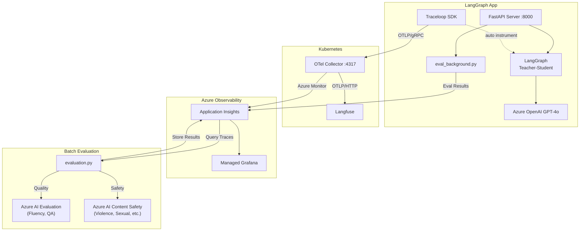

# Agent Observability Deep Dive

---

## Agenda

| # | Topic | Time |
|---|-------|------|
| 1 | Why LLM Observability? | 3 min |
| 2 | Demo App: Teacher-Student Quiz | 3 min |
| 3 | Architecture Deep Dive | 8 min |
| 4 | Code Walkthrough | 6 min |
| 5 | Live Demo | 5 min |
| 6 | Q&A | 5 min |

(Thanks for joining. Today we're covering end-to-end observability for LLM agent apps — OpenTelemetry, Langfuse, and Azure services in one stack. About 30 minutes including Q&A. Let's dive in.)

---

## 1. Why LLM Observability?

### The Problem

LLM-based apps are fundamentally different from traditional apps:

- **Non-deterministic output**: Same input, different response every time
- **Multi-Agent complexity**: Agent call chains are a black box
- **Hard to measure quality**: How do you quantify "did it work well?"
- **Cost & performance tracking**: Token usage and latency need monitoring
- **Safety**: Must automatically detect harmful content generation

(Why a different observability approach for LLMs? Traditional APM tracks status codes and latency — but a 200 OK tells you nothing about whether your agent gave a good answer. LLM apps are non-deterministic, multi-agent chains are black boxes, and you need to track token costs, quality, and safety simultaneously. Fundamentally different monitoring challenge.)

### What This Project Solves

```
"We built an LLM app... but is it actually working well?"
                    ↓
    [Tracing] + [Dashboard] + [Automated Evaluation]
                    ↓
       "Here are the numbers."
```

| Aspect | How | Tool |
|--------|-----|------|
| **Tracing** | Auto-capture LLM input/output | Traceloop SDK + OTel Collector |
| **Visualization** | Real-time dashboards | Langfuse + Azure Grafana |
| **Quality** | Auto-evaluate response quality | Azure AI Evaluation SDK |
| **Safety** | Auto-detect harmful content | Azure AI Content Safety |

(We address this with three pillars: tracing to capture what happened, dashboards to visualize it in real time, and automated evaluation to score quality and safety. All three feed into a unified Azure-native stack. Let me show you how.)

---

## 2. Demo App: Teacher-Student Quiz

### LangGraph Multi-Agent Structure

```
User input: "medium math"

  ┌─────────┐     ┌─────────────────┐     ┌─────────────────┐     ┌─────────────────┐
  │  Setup   │────▶│ Teacher Question│────▶│ Student Answer  │────▶│ Teacher Evaluate│
  │(difficulty│     │ (creates quiz)  │     │ (attempts solve)│     │ (grades answer) │
  │ & subject)│     └─────────────────┘     └─────────────────┘     └─────────────────┘
  └─────────┘           GPT-4o                  GPT-4o                  GPT-4o
```

(Quick intro to the demo app — a multi-agent quiz system built with LangGraph. Four nodes: Setup parses difficulty and subject, Teacher creates a question, Student answers, Teacher evaluates. Three of these make independent GPT-4o calls — so per request, three LLM invocations to trace and evaluate.)

### LangGraph Workflow (graph.py)

```python
# 4 nodes with conditional edges
graph_builder = StateGraph(State)

graph_builder.add_node("setup", setup_handler)                # Parse difficulty/subject
graph_builder.add_node("teacher_question", teacher_question)  # Create question
graph_builder.add_node("student_answer", student_answer)      # Attempt answer
graph_builder.add_node("teacher_evaluate", teacher_evaluate)  # Evaluate answer

graph_builder.add_edge(START, "setup")
graph_builder.add_conditional_edges("setup", route_after_setup, {
    "teacher_question": "teacher_question",
    "end": END,
})
graph_builder.add_edge("teacher_question", "student_answer")
graph_builder.add_edge("student_answer", "teacher_evaluate")
graph_builder.add_edge("teacher_evaluate", END)
```

### Quiz Phase Flow

```
SETUP → QUESTIONING → ANSWERING → EVALUATING → COMPLETE
  ↑                                                 │
  └──────────────── "reset" ────────────────────────┘
```

(The actual LangGraph code — remarkably concise. Conditional edge after setup: invalid input routes to END, otherwise linear flow — Teacher asks, Student answers, Teacher evaluates. Simple pattern, but great testbed for observability since we trace and evaluate each node independently.)

### Live Demo Points
- Open http://localhost:8000
- Enter "medium math" and watch Teacher/Student conversation
- Observe SSE streaming with per-node real-time responses

---

## 3. Architecture Deep Dive

### Conceptual Architecture

```
                        ┌──────────────────────────────────────────────┐
                        │            Kubernetes Cluster                │
                        │                                              │
┌─────────────────┐     │  ┌──────────────┐  OTLP   ┌──────────────┐   │
│   LangGraph     │OTLP │  │              │──HTTP──▶│   Langfuse  │   │
│   FastAPI App   │gRPC─┼──▶OTel Collector│         │   (Web UI)  │   │
│  + Traceloop    │     │  │              │         └──────────────┘   │
└─────────────────┘     │  └──────┬───────┘                            │
   Azure OpenAI         │         │ Azure Monitor                      │
     GPT-4o             └─────────┼────────────────────────────────────┘
                                  ▼
                        ┌────────────────────┐
                        │ Azure Application  │◀──── evaluation.py
                        │     Insights       │       (stores results)
                        └────────┬───────────┘
                                 │ KQL Query
                                 ▼
                        ┌────────────────────┐
                        │  Azure Managed     │
                        │     Grafana        │
                        └────────────────────┘
```

(Here's the full architecture. The app sends OTLP gRPC to the OTel Collector in Kubernetes. The Collector fans out to two destinations: Langfuse via OTLP HTTP for LLM-specific trace UI, and App Insights via Azure Monitor exporter for KQL-queryable storage. Separately, the evaluation pipeline queries traces from App Insights, scores them using Azure AI services, and writes results back. Grafana queries everything via KQL. App Insights acts as the central nervous system connecting tracing and evaluation.)

### Logical Architecture



(Same architecture as a logical diagram — four subsystems. LangGraph app with Traceloop auto-instrumentation, Kubernetes hosting the Collector and Langfuse, Azure observability with App Insights and Grafana, and the evaluation pipeline closing the feedback loop. Key takeaway: App Insights is the single pane of glass — receiving traces and evaluation scores, feeding Grafana.)

### Data Flow Detail

| Step | From | To | Protocol | Data |
|------|------|----|----------|------|
| 1 | FastAPI App | OTel Collector | OTLP/gRPC (:4317) | LLM traces (input/output/tokens) |
| 2 | OTel Collector | Langfuse | OTLP/HTTP | Same traces → LLM-specific UI |
| 3 | OTel Collector | App Insights | Azure Monitor exporter | Same traces → KQL queryable |
| 4 | eval_background.py | App Insights | opencensus (customEvents) | Per-request evaluation scores (quality + safety) |
| 5 | evaluation.py | App Insights | opencensus (customEvents) | Batch evaluation scores (quality + safety) |
| 6 | App Insights | Grafana | KQL query | Traces + evaluation results visualization |

(Step by step: Step 1 — app emits OTLP gRPC, sub-millisecond overhead. Steps 2-3 in parallel — Collector fans out to Langfuse and App Insights. Step 4 — real-time background evaluation per request, zero impact on latency. Step 5 — batch evaluation pipeline for historical analysis via CI/CD or cron. Step 6 — Grafana unifies traces and evaluation scores via KQL.)

### Why Use OTel Collector?

**Without Collector (direct export)**
```
App → Langfuse     (needs SDK A)
App → App Insights (needs SDK B)
App → Other backend (needs SDK C)
```

**With Collector (fan-out)**
```
App → OTel Collector → Langfuse
                     → App Insights
                     → (future backends)
```

- Add/remove backends without changing app code
- Batch processing and memory limits handled by Collector
- App only needs to know OTLP

(Why not export directly? With the Collector, your app speaks one protocol — OTLP. The Collector handles fan-out, batching, retries, and memory management. Want a third backend? Update a YAML config. Zero app code changes. Decouple your telemetry pipeline from your application lifecycle.)

### OTel Collector Config (k8s/otel-collector-values.yaml)

```yaml
config:
  receivers:
    otlp:                          # Receive OTLP from app
      protocols:
        grpc:
          endpoint: 0.0.0.0:4317

  exporters:
    otlphttp/langfuse:             # Forward to Langfuse
      endpoint: "http://langfuse-web:3000/api/public/otel"
    azuremonitor:                  # Forward to App Insights
      connection_string: "InstrumentationKey=..."

  service:
    pipelines:
      traces:
        receivers: [otlp]
        processors: [memory_limiter, batch]
        exporters: [otlphttp/langfuse, azuremonitor]  # Fan-out!
```

(The pipeline definition at the bottom is the key — one receiver, two exporters. That's the entire fan-out. Note: we use the contrib image because the Azure Monitor exporter isn't in the core distribution.)

---

## 4. Code Walkthrough

### 4-1. Traceloop Initialization (main.py)

```python
from traceloop.sdk import Traceloop
from opentelemetry.exporter.otlp.proto.grpc.trace_exporter import OTLPSpanExporter

# OTLP Exporter → sends to OTel Collector
otlp_exporter = OTLPSpanExporter(
    endpoint=OTEL_EXPORTER_OTLP_ENDPOINT,  # "http://collector:4317"
    insecure=True,
)

# Initialize Traceloop → auto-instruments LangChain/OpenAI
Traceloop.init(
    app_name="teacher-student-quiz",
    disable_batch=False,
    exporter=otlp_exporter,
)
```

**Key point**: Traceloop SDK auto-instruments LangChain/OpenAI calls.
Without any code changes, `gen_ai.prompt`, `gen_ai.completion`, and `llm.usage.total_tokens` are captured automatically.

(Three lines of meaningful code. OTLP exporter pointing to the Collector, pass it to Traceloop.init — done. Every LangChain and OpenAI call is automatically traced: prompts, completions, token counts, latency. Zero changes to business logic. That's the power of auto-instrumentation.)

### 4-2. Manual Span Enrichment (main.py - chat_stream)

```python
# Add business metadata on top of auto-instrumentation
with tracer.start_as_current_span("chat_stream") as span:
    # Langfuse-recognized attribute keys
    span.set_attribute("langfuse.trace.name", "langgraph-session")
    span.set_attribute("langfuse.session.id", session_id)
    span.set_attribute("langfuse.trace.input", user_input)

    # Run LangGraph
    async for event in graph.astream(invoke_state, config=config, stream_mode="updates"):
        # ... streaming logic ...

    # Record final output
    span.set_attribute("langfuse.trace.output", final_output)
```

**Key point**: Setting `langfuse.*` prefix attributes enables trace/session grouping in the Langfuse UI.

(Auto-instrumentation handles LLM telemetry, but we also want business context. We create a manual span with Langfuse-recognized attributes — anything prefixed `langfuse.` gets special treatment in the UI. For example, `langfuse.session.id` groups traces by session. Pattern: auto-instrumentation for heavy lifting, manual spans for business context.)

### 4-3. Evaluation Pipeline (evaluation.py)

```python
# Step 1: Query traces from App Insights (KQL)
traces = query_traces_from_app_insights(hours=24, limit=100)
#   → Extracts gen_ai.prompt, gen_ai.completion from AppDependencies table

# Step 2: Quality evaluation (Azure AI Evaluation SDK)
result = evaluate(
    data=str(data_path),
    evaluators={
        "fluency": FluencyEvaluator(model_config),
        "coherence": CoherenceEvaluator(model_config),
        "relevance": RelevanceEvaluator(model_config),
        "groundedness": GroundednessEvaluator(model_config),
    },
)

# Step 3: Safety evaluation (Azure AI Content Safety)
client = ContentSafetyClient(endpoint, credential)
response = client.analyze_text(AnalyzeTextOptions(text=text))
# → Violence, Hate, Sexual, SelfHarm categories scored 0-6

# Step 4: Send results to App Insights as customEvents
logger.info("evaluation_result", extra={"custom_dimensions": event_properties})
# → Queryable via KQL in Grafana
```

(Four-step batch process. Step 1: query App Insights for LLM traces via KQL. Step 2: run four quality evaluators — fluency, coherence, relevance, groundedness — scored 1-to-5. Step 3: Azure Content Safety for violence, hate, sexual, self-harm — scored 0-to-6. Step 4: write scores back to App Insights as custom events. This closes the loop — Grafana shows not just what happened, but how well it performed.)

### 4-4. Real-time Background Evaluation (eval_background.py)

```python
# In main.py — after returning the response to the user:
asyncio.create_task(
    asyncio.to_thread(evaluate_single, user_input, final_output)
)
# → Runs quality + safety evaluation in a background thread
# → Zero impact on response latency
```

```python
# eval_background.py — evaluate_single()
def evaluate_single(query: str, response: str) -> dict:
    # Quality: Fluency, Coherence, Relevance, Groundedness (1-5)
    # Safety: Violence, Sexual, SelfHarm, Hate (0-6)
    # → Send results to App Insights customEvents
    logger.info("evaluation_result", extra={"custom_dimensions": result})
```

**Key point**: Every chat response triggers evaluation automatically. No manual pipeline run needed for near real-time monitoring.

(Can we get evaluation scores in near real-time? After the response is sent, we spawn a background thread via asyncio.to_thread that runs quality and safety evaluations. Completely non-blocking — zero additional latency for the user. Results appear in Grafana within about five minutes. Continuous quality signal, no manual pipeline needed.)

### 4-5. Evaluation ↔ Observability Connection

```
                        App Insights
                    ┌───────────────────┐
OTel Collector ────▶│ AppDependencies   │ ← LLM traces (auto)
                    │  (traces storage)  │
                    │                   │      ┌──────────────────┐
evaluation.py ─────▶│ customEvents      │─────▶│ Grafana Dashboard│
  ↑  query (KQL)    │  (eval results)   │      │  - Quality Scores│
  └─────────────────│                   │      │  - Safety Scores │
                    └───────────────────┘      │  - Trends        │
                                               └──────────────────┘
```

(Key insight: App Insights is the central store for both traces and evaluation results. Collector writes to AppDependencies, evaluation pipeline writes to customEvents, Grafana queries both. Two data flows, one data store, one dashboard.)

---

## 5. Live Demo

### Demo 1: Run Quiz App & Observe Tracing

```bash
# Start server
uv run main.py

# Open browser
# http://localhost:8000
# Enter "medium math"
```

**What to observe:**
- Teacher → Student → Teacher three-step execution
- SSE streaming with per-node real-time responses

(Let's switch to the live demo. I'll type "medium math" — watch the three agents execute in sequence with real-time SSE streaming. Behind the scenes, Traceloop captures every LLM call and the background evaluator scores this interaction automatically.)


### Demo 2: Traces in Langfuse


**What to observe:**
- Click the `langgraph-session` trace
- Full LLM input/output for each call
- Token usage and latency
- Session-grouped conversation flow

(Here's Langfuse showing the trace for that quiz session — grouped under langgraph-session. Click in and you see each LLM call: exact prompt, completion, token counts, latency. All captured automatically by Traceloop. This is prompt-level debugging that traditional APM cannot provide.)

### Demo 3: Grafana Dashboard


**Grafana panels:**

| Panel | Data Source | Description |
|-------|------------|-------------|
| LangGraph Agent Summary | AppDependencies | Total traces, LLM calls, tokens, success rate |
| Agent Execution Trends | AppDependencies | Execution trends over time (success/failure) |
| LLM Call Trends | AppDependencies | LLM call counts + token usage over time |
| Node Performance | AppDependencies | Per-node avg latency and call counts |
| Quality Evaluation Scores | customEvents | Fluency, Coherence, Relevance, Groundedness |
| Safety Evaluation Scores | customEvents | Violence, Sexual, SelfHarm, HateUnfairness |
| Score Trends | customEvents | Quality/safety score trends over time |

(Here's the Grafana dashboard — everything in one place. Top row: operational metrics — executions, LLM calls, tokens, success rates. Middle: node-level performance breakdown. Bottom: evaluation scores — quality and safety. All powered by KQL against App Insights, fully customizable.)

### Demo 4: Run Evaluation Pipeline

```bash
# Evaluate traces from the last 24 hours
uv run python evaluation.py --hours 24 --limit 100
```

**What to observe:**
- Trace query from App Insights
- Quality scores (1-5 scale)
- Safety scores (0-6 scale, 0 = safe)
- Results appearing in Grafana

(Let me kick off the batch evaluation. It queries 24 hours of traces, runs quality and safety analysis, pushes scores back to App Insights. In production, run this as a cron job or CI/CD step. Scores update in Grafana within minutes — your quality regression detection mechanism.)

---

## 6. Tech Stack Summary

| Layer | Technology | Role |
|-------|-----------|------|
| **Application** | FastAPI + LangGraph | Web server + Multi-Agent workflow |
| **LLM** | Azure OpenAI GPT-4o | Brain for Teacher/Student agents |
| **Auto-Instrumentation** | Traceloop SDK | Auto-capture LangChain/OpenAI calls |
| **Trace Transport** | OTel Collector (K8s) | OTLP receive → fan-out to Langfuse + App Insights |
| **LLM Observability** | Langfuse (K8s) | LLM-specific trace UI |
| **Trace Storage** | Azure Application Insights | General-purpose trace store + KQL queries |
| **Dashboard** | Azure Managed Grafana | Custom dashboards (KQL-based) |
| **Quality Eval** | Azure AI Evaluation SDK | Fluency, Coherence, Relevance, Groundedness |
| **Safety Eval** | Azure AI Content Safety | Violence, Sexual, SelfHarm, Hate detection |

(Full tech stack in one table. Design principle: separation of concerns — app handles business logic, Traceloop handles instrumentation, Collector handles routing, Azure services handle storage and evaluation. OTel Collector is the decoupling layer.)

---

## Key Takeaways

1. **OpenTelemetry works for LLM apps too**
   - Traceloop SDK auto-instruments LangChain/OpenAI
   - Reuse existing OTel infrastructure (Collector, App Insights, Grafana)

2. **OTel Collector = universal trace router**
   - Fan-out to multiple backends without app code changes
   - Langfuse (LLM-specific) + App Insights (general-purpose) simultaneously

3. **Observability + Evaluation = complete monitoring**
   - Tracing alone is not enough → automated quality/safety evaluation is essential
   - Store evaluation results back in App Insights → unified view in Grafana

4. **Production considerations**
   - Set `OTEL_ATTRIBUTE_VALUE_LENGTH_LIMIT` higher (LLM messages are long)
   - Enable `TRACELOOP_TRACE_CONTENT=true` (disabled by default)
   - Run evaluation as a batch job (CI/CD or cron)

(Four takeaways. First — OTel works for LLM apps too, reuse your existing infrastructure. Second — OTel Collector is the architectural linchpin for zero-code-change fan-out. Third — tracing alone isn't enough; automated quality and safety evaluation turns observability into actionable intelligence. Fourth — production gotchas: increase attribute length limits, enable content capture in Traceloop, run evaluation on a schedule. Thank you — happy to take questions.)

---

## Appendix A: Project Structure

```
otel-langfuse/
├── main.py              # FastAPI server + OpenTelemetry initialization
├── graph.py             # LangGraph workflow (Teacher-Student Quiz)
├── eval_background.py   # Async background evaluation (auto per request)
├── evaluation.py        # Azure AI Evaluation batch pipeline
├── config.py            # Configuration loader (.env)
├── pyproject.toml       # Python dependencies (uv)
├── .env                 # Environment variables (git ignored)
├── evaluation_results/  # Evaluation results directory
│   ├── evaluation_data.jsonl
│   ├── quality_evaluation_result.json
│   ├── safety_evaluation_result.json
│   └── evaluation_metrics.json
├── templates/
│   └── index.html       # Web UI
├── static/
│   └── style.css        # Stylesheet
└── k8s/
    ├── langfuse-values.yaml           # Langfuse Helm values
    ├── otel-collector-values.yaml     # OTel Collector Helm values
    └── azure-grafana-langgraph.json   # Azure Managed Grafana dashboard (v2)
```

(Full project structure for anyone who wants to clone the repo. Five core Python files at the top, k8s directory with Helm values and Grafana dashboard JSON you can import directly.)

---

## Appendix B: Environment Variables

| Variable | Description |
|----------|-------------|
| `AZURE_OPENAI_ENDPOINT` | Azure OpenAI endpoint URL |
| `AZURE_OPENAI_API_KEY` | Azure OpenAI API key |
| `AZURE_OPENAI_DEPLOYMENT_NAME` | Deployment name (e.g., `gpt-4o`) |
| `AZURE_OPENAI_API_VERSION` | API version (e.g., `2024-08-01-preview`) |
| `OTEL_EXPORTER_OTLP_ENDPOINT` | OTel Collector gRPC endpoint (e.g., `http://<ip>:4317`) |
| `APP_INSIGHTS_WORKSPACE_ID` | Log Analytics workspace ID (for KQL queries) |
| `APP_INSIGHTS_CONNECTION_STRING` | App Insights connection string |
| `AZURE_CONTENT_SAFETY_ENDPOINT` | Azure AI Content Safety endpoint |
| `AZURE_CONTENT_SAFETY_KEY` | Azure AI Content Safety API key |

(All the environment variables you need. Azure OpenAI credentials, OTel Collector endpoint, App Insights connection, and optionally Content Safety for safety scoring. Copy the env template and fill in your values.)

---

## Appendix C: Quick Start

```bash
# 1. Install dependencies
uv sync

# 2. Set up environment variables
cp .env.example .env
# Edit .env with your values

# 3. Run the server (background eval runs automatically per request)
.\.venv\Scripts\Activate.ps1
python main.py
# → http://localhost:8000

# 4. Run batch evaluation pipeline (optional, for historical analysis)
uv run python evaluation.py --hours 24 --limit 100
```

**Requirements**: Python 3.10+, [uv](https://github.com/astral-sh/uv) package manager

(Three commands to get started: uv sync, activate venv, run main.py. Background evaluation runs automatically per request. Batch evaluation is optional for historical analysis. We use uv — dramatically faster than pip.)

---

## Appendix D: Evaluation Metrics Reference

### Quality Evaluation (Azure AI Evaluation SDK)

| Metric | Scale | Description |
|--------|-------|-------------|
| Fluency | 1-5 | Linguistic quality and readability |
| Coherence | 1-5 | Logical consistency and flow |
| Relevance | 1-5 | How well the response addresses the query |
| Groundedness | 1-5 | Factual accuracy based on provided context |

### Safety Evaluation (Azure AI Content Safety)

| Category | Scale | Description |
|----------|-------|-------------|
| Violence | 0-6 | Violence-related content (0 = safe) |
| Sexual | 0-6 | Sexual content (0 = safe) |
| SelfHarm | 0-6 | Self-harm related content (0 = safe) |
| HateUnfairness | 0-6 | Hate speech or discrimination (0 = safe) |

(Quality: four dimensions scored 1-to-5. Safety: four categories scored 0-to-6 where 0 is safe. All eight metrics tracked over time in Grafana for immediate regression visibility.)

---

## References

- [OpenTelemetry](https://opentelemetry.io/)
- [Traceloop SDK](https://github.com/traceloop/openllmetry)
- [LangGraph](https://langchain-ai.github.io/langgraph/)
- [Langfuse](https://langfuse.com/)
- [Azure AI Evaluation SDK](https://learn.microsoft.com/azure/ai-studio/how-to/develop/evaluate-sdk)
- [Azure AI Content Safety](https://learn.microsoft.com/azure/ai-services/content-safety/)
- [Azure Managed Grafana](https://learn.microsoft.com/azure/managed-grafana/)
