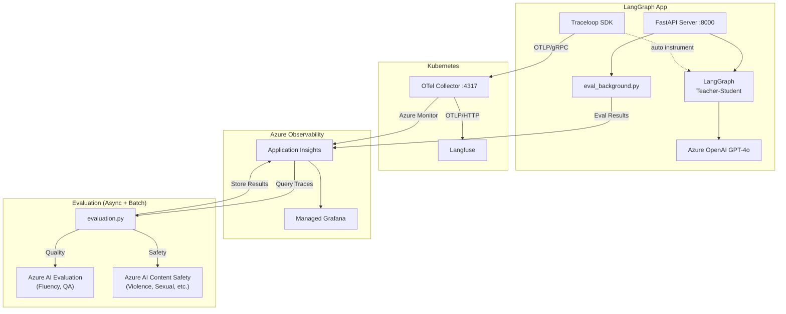

# Agent Observability Deep Dive

---

## Agenda

| # | Topic | Time |
|---|-------|------|
| 1 | Why LLM Observability? | 3 min |
| 2 | Demo App: Teacher-Student Quiz | 3 min |
| 3 | Architecture Deep Dive | 8 min |
| 4 | Code Walkthrough | 6 min |
| 5 | Live Demo | 5 min |
| 6 | Q&A | 5 min |

---

## 1. Why LLM Observability?

### ⚠️ The Problem

LLM-based apps are fundamentally different from traditional apps:

- **Non-deterministic output**: Same input, different response every time
- **Multi-Agent complexity**: Agent call chains are a black box
- **Hard to measure quality**: How do you quantify "did it work well?"
- **Cost & performance tracking**: Token usage and latency need monitoring
- **Safety**: Must automatically detect harmful content generation

### ✅ What This Project Solves

```
"We built an LLM app... but is it actually working well?"
                    ↓
    [Tracing] + [Dashboard] + [Automated Evaluation]
                    ↓
       "Here are the numbers."
```

| Aspect | How | Tool |
|--------|-----|------|
| **Tracing** | Auto-capture LLM input/output | Traceloop SDK + OTel Collector |
| **Visualization** | Real-time dashboards | Langfuse + Azure Grafana |
| **Quality** | Auto-evaluate response quality | Azure AI Evaluation SDK |
| **Safety** | Auto-detect harmful content | Azure AI Content Safety |

---

## 2. Demo App: Teacher-Student Quiz

### LangGraph Multi-Agent Structure

```
User input: "medium math"

  ┌─────────┐     ┌─────────────────┐     ┌─────────────────┐     ┌─────────────────┐
  │  Setup   │────▶│ Teacher Question│────▶│ Student Answer  │────▶│ Teacher Evaluate│
  │(difficulty│     │ (creates quiz)  │     │ (attempts solve)│     │ (grades answer) │
  │ & subject)│     └─────────────────┘     └─────────────────┘     └─────────────────┘
  └─────────┘           GPT-4o                  GPT-4o                  GPT-4o
```

### LangGraph Workflow (graph.py)

```python
# 4 nodes with conditional edges
graph_builder = StateGraph(State)

graph_builder.add_node("setup", setup_handler)                # Parse difficulty/subject
graph_builder.add_node("teacher_question", teacher_question)  # Create question
graph_builder.add_node("student_answer", student_answer)      # Attempt answer
graph_builder.add_node("teacher_evaluate", teacher_evaluate)  # Evaluate answer

graph_builder.add_edge(START, "setup")
graph_builder.add_conditional_edges("setup", route_after_setup, {
    "teacher_question": "teacher_question",
    "end": END,
})
graph_builder.add_edge("teacher_question", "student_answer")
graph_builder.add_edge("student_answer", "teacher_evaluate")
graph_builder.add_edge("teacher_evaluate", END)
```

### Quiz Phase Flow

```
SETUP → QUESTIONING → ANSWERING → EVALUATING → COMPLETE
  ↑                                                 │
  └──────────────── "reset" ────────────────────────┘
```

### Live Demo Points
- Open http://localhost:8000
- Enter "medium math" and watch Teacher/Student conversation
- Observe SSE streaming with per-node real-time responses

---

## 3. Architecture Deep Dive

### Conceptual Architecture

```
                        ┌──────────────────────────────────────────────┐
                        │            Kubernetes Cluster                │
                        │                                              │
┌─────────────────┐     │  ┌──────────────┐  OTLP   ┌──────────────┐   │
│   LangGraph     │OTLP │  │              │──HTTP──▶│   Langfuse  │   │
│   FastAPI App   │gRPC─┼──▶OTel Collector│         │   (Web UI)  │   │
│  + Traceloop    │     │  │              │         └──────────────┘   │
└─────────────────┘     │  └──────┬───────┘                            │
   Azure OpenAI         │         │ Azure Monitor                      │
     GPT-4o             └─────────┼────────────────────────────────────┘
                                  ▼
                        ┌────────────────────┐
                        │ Azure Application  │◀──── evaluation.py
                        │     Insights       │       (stores results)
                        └────────┬───────────┘
                                 │ KQL Query
                                 ▼
                        ┌────────────────────┐
                        │  Azure Managed     │
                        │     Grafana        │
                        └────────────────────┘
```

### Logical Architecture



### Data Flow Detail

| Step | From | To | Protocol | Data |
|------|------|----|----------|------|
| 1 | FastAPI App | OTel Collector | OTLP/gRPC (:4317) | LLM traces (input/output/tokens) |
| 2 | OTel Collector | Langfuse | OTLP/HTTP | Same traces → LLM-specific UI |
| 3 | OTel Collector | App Insights | Azure Monitor exporter | Same traces → KQL queryable |
| 4 | eval_background.py | App Insights | opencensus (customEvents) | Per-request evaluation scores (quality + safety) |
| 5 | evaluation.py | App Insights | opencensus (customEvents) | Batch evaluation scores (quality + safety) |
| 6 | App Insights | Grafana | KQL query | Traces + evaluation results visualization |

### 🔥 Why Use OTel Collector?

**Without Collector (direct export)**
```
App → Langfuse     (needs SDK A)
App → App Insights (needs SDK B)
App → Other backend (needs SDK C)
```

**With Collector (fan-out)**
```
App → OTel Collector → Langfuse
                     → App Insights
                     → (future backends)
```

- Add/remove backends without changing app code
- Batch processing and memory limits handled by Collector
- App only needs to know OTLP

### OTel Collector Config (k8s/otel-collector-values.yaml)

```yaml
config:
  receivers:
    otlp:                          # Receive OTLP from app
      protocols:
        grpc:
          endpoint: 0.0.0.0:4317

  exporters:
    otlphttp/langfuse:             # Forward to Langfuse
      endpoint: "http://langfuse-web:3000/api/public/otel"
    azuremonitor:                  # Forward to App Insights
      connection_string: "InstrumentationKey=..."

  service:
    pipelines:
      traces:
        receivers: [otlp]
        processors: [memory_limiter, batch]
        exporters: [otlphttp/langfuse, azuremonitor]  # Fan-out!
```

---

## 4. Code Walkthrough

### 4-1. Traceloop Initialization (main.py)

```python
from traceloop.sdk import Traceloop
from opentelemetry.exporter.otlp.proto.grpc.trace_exporter import OTLPSpanExporter

# OTLP Exporter → sends to OTel Collector
otlp_exporter = OTLPSpanExporter(
    endpoint=OTEL_EXPORTER_OTLP_ENDPOINT,  # "http://collector:4317"
    insecure=True,
)

# Initialize Traceloop → auto-instruments LangChain/OpenAI
Traceloop.init(
    app_name="teacher-student-quiz",
    disable_batch=False,
    exporter=otlp_exporter,
)
```

✅ **Key point**: Traceloop SDK auto-instruments LangChain/OpenAI calls.
Without any code changes, `gen_ai.prompt`, `gen_ai.completion`, and `llm.usage.total_tokens` are captured automatically.

### 4-2. Manual Span Enrichment (main.py - chat_stream)

```python
# Add business metadata on top of auto-instrumentation
with tracer.start_as_current_span("chat_stream") as span:
    # Langfuse-recognized attribute keys
    span.set_attribute("langfuse.trace.name", "langgraph-session")
    span.set_attribute("langfuse.session.id", session_id)
    span.set_attribute("langfuse.trace.input", user_input)

    # Run LangGraph
    async for event in graph.astream(invoke_state, config=config, stream_mode="updates"):
        # ... streaming logic ...

    # Record final output
    span.set_attribute("langfuse.trace.output", final_output)
```

✅ **Key point**: Setting `langfuse.*` prefix attributes enables trace/session grouping in the Langfuse UI.

### 4-3. Evaluation Pipeline (evaluation.py)

```python
# Step 1: Query traces from App Insights (KQL)
traces = query_traces_from_app_insights(hours=24, limit=100)
#   → Extracts gen_ai.prompt, gen_ai.completion from AppDependencies table

# Step 2: Quality evaluation (Azure AI Evaluation SDK)
result = evaluate(
    data=str(data_path),
    evaluators={
        "fluency": FluencyEvaluator(model_config),
        "coherence": CoherenceEvaluator(model_config),
        "relevance": RelevanceEvaluator(model_config),
        "groundedness": GroundednessEvaluator(model_config),
    },
)

# Step 3: Safety evaluation (Azure AI Content Safety)
client = ContentSafetyClient(endpoint, credential)
response = client.analyze_text(AnalyzeTextOptions(text=text))
# → Violence, Hate, Sexual, SelfHarm categories scored 0-6

# Step 4: Send results to App Insights as customEvents
logger.info("evaluation_result", extra={"custom_dimensions": event_properties})
# → Queryable via KQL in Grafana
```

### 4-4. 🔥 Real-time Background Evaluation (eval_background.py)

```python
# In main.py — after returning the response to the user:
asyncio.create_task(
    asyncio.to_thread(evaluate_single, user_input, final_output)
)
# → Runs quality + safety evaluation in a background thread
# → Zero impact on response latency
```

```python
# eval_background.py — evaluate_single()
def evaluate_single(query: str, response: str) -> dict:
    # Quality: Fluency, Coherence, Relevance, Groundedness (1-5)
    # Safety: Violence, Sexual, SelfHarm, Hate (0-6)
    # → Send results to App Insights customEvents
    logger.info("evaluation_result", extra={"custom_dimensions": result})
```

✅ **Key point**: Every chat response triggers evaluation automatically. No manual pipeline run needed for near real-time monitoring.

### 4-5. Evaluation ↔ Observability Connection

```
                        App Insights
                    ┌───────────────────┐
OTel Collector ────▶│ AppDependencies   │ ← LLM traces (auto)
                    │  (traces storage)  │
                    │                   │      ┌──────────────────┐
evaluation.py ─────▶│ customEvents      │─────▶│ Grafana Dashboard│
  ↑  query (KQL)    │  (eval results)   │      │  - Quality Scores│
  └─────────────────│                   │      │  - Safety Scores │
                    └───────────────────┘      │  - Trends        │
                                               └──────────────────┘
```

---

## 5. Live Demo

### Demo 1: Run Quiz App & Observe Tracing

```bash
# Start server
uv run main.py

# Open browser
# http://localhost:8000
# Enter "medium math"
```

**What to observe:**
- Teacher → Student → Teacher three-step execution
- SSE streaming with per-node real-time responses


### Demo 2: Traces in Langfuse


**What to observe:**
- Click the `langgraph-session` trace
- Full LLM input/output for each call
- Token usage and latency
- Session-grouped conversation flow

### Demo 3: Grafana Dashboard


**Grafana panels:**

| Panel | Data Source | Description |
|-------|------------|-------------|
| LangGraph Agent Summary | AppDependencies | Total traces, LLM calls, tokens, success rate |
| Agent Execution Trends | AppDependencies | Execution trends over time (success/failure) |
| LLM Call Trends | AppDependencies | LLM call counts + token usage over time |
| Node Performance | AppDependencies | Per-node avg latency and call counts |
| Quality Evaluation Scores | customEvents | Fluency, Coherence, Relevance, Groundedness |
| Safety Evaluation Scores | customEvents | Violence, Sexual, SelfHarm, HateUnfairness |
| Score Trends | customEvents | Quality/safety score trends over time |

### Demo 4: Run Evaluation Pipeline

```bash
# Evaluate traces from the last 24 hours
uv run python evaluation.py --hours 24 --limit 100
```

**What to observe:**
- Trace query from App Insights
- Quality scores (1-5 scale)
- Safety scores (0-6 scale, 0 = safe)
- Results appearing in Grafana

---

## 6. Tech Stack Summary

| Layer | Technology | Role |
|-------|-----------|------|
| **Application** | FastAPI + LangGraph | Web server + Multi-Agent workflow |
| **LLM** | Azure OpenAI GPT-4o | Brain for Teacher/Student agents |
| **Auto-Instrumentation** | Traceloop SDK | Auto-capture LangChain/OpenAI calls |
| **Trace Transport** | OTel Collector (K8s) | OTLP receive → fan-out to Langfuse + App Insights |
| **LLM Observability** | Langfuse (K8s) | LLM-specific trace UI |
| **Trace Storage** | Azure Application Insights | General-purpose trace store + KQL queries |
| **Dashboard** | Azure Managed Grafana | Custom dashboards (KQL-based) |
| **Quality Eval** | Azure AI Evaluation SDK | Fluency, Coherence, Relevance, Groundedness |
| **Safety Eval** | Azure AI Content Safety | Violence, Sexual, SelfHarm, Hate detection |

---

## 🚀 Key Takeaways

1. **OpenTelemetry works for LLM apps too**
   - Traceloop SDK auto-instruments LangChain/OpenAI
   - Reuse existing OTel infrastructure (Collector, App Insights, Grafana)

2. **OTel Collector = universal trace router**
   - Fan-out to multiple backends without app code changes
   - Langfuse (LLM-specific) + App Insights (general-purpose) simultaneously

3. **Observability + Evaluation = complete monitoring**
   - Tracing alone is not enough → automated quality/safety evaluation is essential
   - Store evaluation results back in App Insights → unified view in Grafana

4. **⚠️ Production considerations**
   - Set `OTEL_ATTRIBUTE_VALUE_LENGTH_LIMIT` higher (LLM messages are long)
   - Enable `TRACELOOP_TRACE_CONTENT=true` (disabled by default)
   - Run evaluation as a batch job (CI/CD or cron)

---

## Appendix A: Project Structure

```
otel-langfuse/
├── main.py              # FastAPI server + OpenTelemetry initialization
├── graph.py             # LangGraph workflow (Teacher-Student Quiz)
├── eval_background.py   # Async background evaluation (auto per request)
├── evaluation.py        # Azure AI Evaluation batch pipeline
├── config.py            # Configuration loader (.env)
├── pyproject.toml       # Python dependencies (uv)
├── .env                 # Environment variables (git ignored)
├── evaluation_results/  # Evaluation results directory
│   ├── evaluation_data.jsonl
│   ├── quality_evaluation_result.json
│   ├── safety_evaluation_result.json
│   └── evaluation_metrics.json
├── templates/
│   └── index.html       # Web UI
├── static/
│   └── style.css        # Stylesheet
└── k8s/
    ├── langfuse-values.yaml           # Langfuse Helm values
    ├── otel-collector-values.yaml     # OTel Collector Helm values
    └── azure-grafana-langgraph.json   # Azure Managed Grafana dashboard (v2)
```

---

## Appendix B: Environment Variables

| Variable | Description |
|----------|-------------|
| `AZURE_OPENAI_ENDPOINT` | Azure OpenAI endpoint URL |
| `AZURE_OPENAI_API_KEY` | Azure OpenAI API key |
| `AZURE_OPENAI_DEPLOYMENT_NAME` | Deployment name (e.g., `gpt-4o`) |
| `AZURE_OPENAI_API_VERSION` | API version (e.g., `2024-08-01-preview`) |
| `OTEL_EXPORTER_OTLP_ENDPOINT` | OTel Collector gRPC endpoint (e.g., `http://<ip>:4317`) |
| `APP_INSIGHTS_WORKSPACE_ID` | Log Analytics workspace ID (for KQL queries) |
| `APP_INSIGHTS_CONNECTION_STRING` | App Insights connection string |
| `AZURE_CONTENT_SAFETY_ENDPOINT` | Azure AI Content Safety endpoint |
| `AZURE_CONTENT_SAFETY_KEY` | Azure AI Content Safety API key |

---

## Appendix C: Quick Start

```bash
# 1. Install dependencies
uv sync

# 2. Set up environment variables
cp .env.example .env
# Edit .env with your values

# 3. Run the server (background eval runs automatically per request)
.\.venv\Scripts\Activate.ps1
python main.py
# → http://localhost:8000

# 4. Run batch evaluation pipeline (optional, for historical analysis)
uv run python evaluation.py --hours 24 --limit 100
```

**Requirements**: Python 3.10+, [uv](https://github.com/astral-sh/uv) package manager

---

## Appendix D: Evaluation Metrics Reference

### Quality Evaluation (Azure AI Evaluation SDK)

| Metric | Scale | Description |
|--------|-------|-------------|
| Fluency | 1-5 | Linguistic quality and readability |
| Coherence | 1-5 | Logical consistency and flow |
| Relevance | 1-5 | How well the response addresses the query |
| Groundedness | 1-5 | Factual accuracy based on provided context |

### Safety Evaluation (Azure AI Content Safety)

| Category | Scale | Description |
|----------|-------|-------------|
| Violence | 0-6 | Violence-related content (0 = safe) |
| Sexual | 0-6 | Sexual content (0 = safe) |
| SelfHarm | 0-6 | Self-harm related content (0 = safe) |
| HateUnfairness | 0-6 | Hate speech or discrimination (0 = safe) |

---

## References

- [OpenTelemetry](https://opentelemetry.io/)
- [Traceloop SDK](https://github.com/traceloop/openllmetry)
- [LangGraph](https://langchain-ai.github.io/langgraph/)
- [Langfuse](https://langfuse.com/)
- [Azure AI Evaluation SDK](https://learn.microsoft.com/azure/ai-studio/how-to/develop/evaluate-sdk)
- [Azure AI Content Safety](https://learn.microsoft.com/azure/ai-services/content-safety/)
- [Azure Managed Grafana](https://learn.microsoft.com/azure/managed-grafana/)
