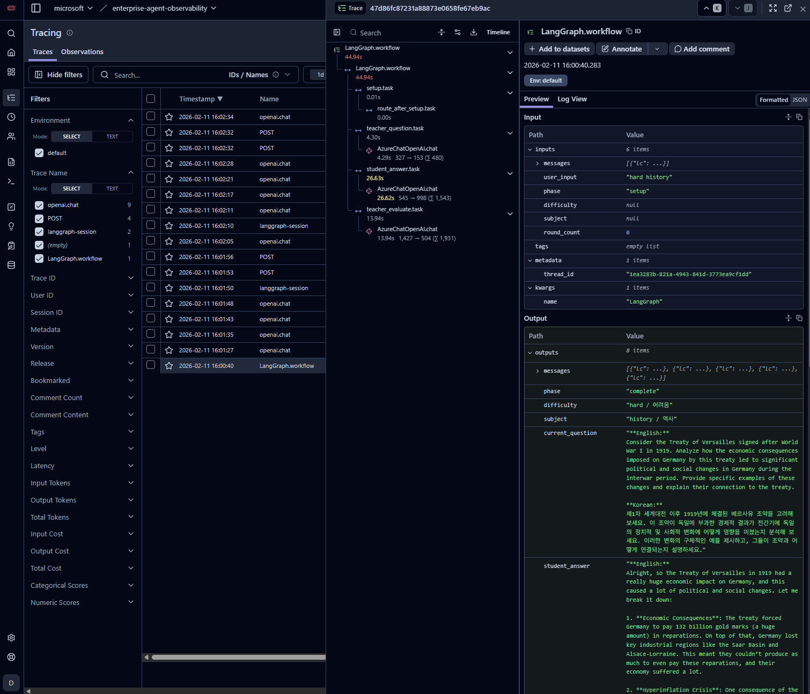
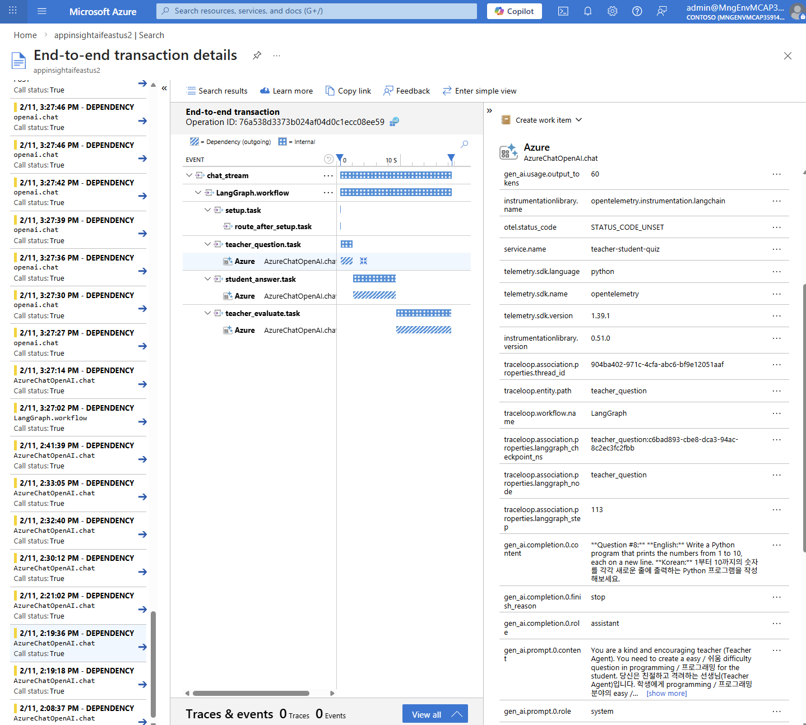

# Agent observability with OpenTelemetry

> 🇰🇷 [한국어](#한국어) | 🇺🇸 [English](#english)

---

# 한국어

LangGraph 기반 Teacher-Student 퀴즈 시스템에서 **OpenTelemetry Collector**를 통해 LLM observability 데이터를 Langfuse로 전송합니다.

## 🏗️ Architecture

```
┌─────────────┐     ┌──────────────┐     ┌──────────────┐
│  LangGraph  │────▶│    OTel      │────▶│   Langfuse   │
│  (FastAPI)  │     │  Collector   │     │    (K8s)     │
│ + Traceloop │     │    (K8s)     │     │              │
└─────────────┘     └──────────────┘     └──────────────┘
      OTLP/gRPC       │  OTLP/HTTP
                      │  Azure Monitor
                      ▼
                    ┌──────────────┐
                    │    Azure     │◀──────────────────────┐
                    │ Application  │                       │
                    │   Insights   │                       │
                    └──────────────┘                       │
                         │    │                            │
            ┌────────────┘    └────────────┐               │
            ▼                              ▼               │
┌──────────────────┐            ┌──────────────────┐       │
│  Azure Managed   │            │   Evaluation     │───────┘
│     Grafana      │            │    Pipeline      │  (Results)
│   (Dashboard)    │            │  (evaluation.py) │
└──────────────────┘            └──────────────────┘
        ▲                              │    │
        │                 ┌────────────┘    └────────────┐
        │                 ▼                              ▼
        │      ┌──────────────────┐         ┌──────────────────┐
        │      │ Azure AI Eval SDK│         │Azure AI Content  │
        │      │  (Fluency, QA)   │         │     Safety       │
        │      └──────────────────┘         └──────────────────┘
        │
   Traces + Eval Results
```

- **Traceloop SDK**: Auto-instrument LangChain/OpenAI calls to capture LLM input/output
- **OTel Collector**: Forward traces to Langfuse (OTLP/HTTP) and Azure Application Insights (Azure Monitor exporter) simultaneously
- **Langfuse**: LLM observability dashboard
- **Azure Application Insights**: Trace storage & query
- **Azure Managed Grafana**: Custom dashboard visualization
- **Evaluation Pipeline**: Automated quality & safety evaluation
  - **Azure AI Evaluation SDK**: Fluency, Coherence, Relevance, Groundedness
  - **Azure AI Content Safety**: Violence, Sexual, SelfHarm, Hate detection

## 📁 프로젝트 구조

```
otel-langfuse/
├── main.py              # FastAPI 서버 + OpenTelemetry 초기화
├── graph.py             # LangGraph 워크플로우 (Teacher-Student 퀴즈)
├── eval_background.py   # 비동기 백그라운드 평가 (요청마다 자동 실행)
├── evaluation.py        # Azure AI Evaluation 배치 파이프라인
├── config.py            # 환경설정 로드 (.env)
├── pyproject.toml       # Python 의존성 (uv)
├── .env                 # 환경변수 (git ignore)
├── evaluation_results/  # 평가 결과 저장 디렉토리
│   ├── evaluation_data.jsonl
│   ├── quality_evaluation_result.json
│   ├── safety_evaluation_result.json
│   └── evaluation_metrics.json
├── templates/
│   └── index.html       # 웹 UI
├── static/
│   └── style.css        # 스타일시트
└── k8s/
    ├── langfuse-values.yaml           # Langfuse Helm values
    ├── otel-collector-values.yaml     # OTel Collector Helm values
    └── azure-grafana-langgraph.json   # Azure Managed Grafana 대시보드
```

## 🚀 시작하기

### 1. 환경 설정

```bash
cp .env.example .env
vim .env
```

### 2. 의존성 설치

```bash
uv sync
```

### 3. 서버 실행

```bash
uv run main.py
```

브라우저에서 http://localhost:8000 접속

## 🎮 데모 앱: Teacher-Student 퀴즈

LangGraph Multi-Agent 시스템으로 구현된 퀴즈 애플리케이션:

- **Teacher Agent**: 문제 출제 및 평가
- **Student Agent**: 문제 풀이 시연

### 사용 예시
```
사용자: "보통 수학 문제"
→ Teacher가 중간 난이도 수학 문제 출제
→ Student가 풀이 과정과 함께 답변
→ Teacher가 정답 여부 평가
```

## ☸️ Kubernetes 배포

### Langfuse 설치

```bash
helm repo add langfuse https://langfuse.github.io/langfuse-k8s
helm install langfuse langfuse/langfuse -f k8s/langfuse-values.yaml -n langfuse --create-namespace
```

### OpenTelemetry Collector 설치

```bash
# Helm repo 추가
helm repo add open-telemetry https://open-telemetry.github.io/opentelemetry-helm-charts
helm repo update

# OTel Collector 설치
helm install otel-collector open-telemetry/opentelemetry-collector \
    --namespace otel-system --create-namespace \
    --values k8s/otel-collector-values.yaml
```

## 🔧 환경 변수

| 변수 | 설명 | 필수 |
|------|------|------|
| `AZURE_OPENAI_ENDPOINT` | Azure OpenAI 엔드포인트 | ✅ |
| `AZURE_OPENAI_API_KEY` | Azure OpenAI API 키 | ✅ |
| `AZURE_OPENAI_DEPLOYMENT_NAME` | 배포 이름 | ❌ (기본: gpt-4o) |
| `AZURE_OPENAI_API_VERSION` | API 버전 | ❌ |
| `OTEL_EXPORTER_OTLP_ENDPOINT` | OTel Collector gRPC 주소 | ❌ (기본: localhost:4317) |
| `APP_INSIGHTS_WORKSPACE_ID` | Application Insights 워크스페이스 ID | ❌ (평가용) |
| `APP_INSIGHTS_CONNECTION_STRING` | Application Insights 연결 문자열 | ❌ (평가용) |
| `AZURE_CONTENT_SAFETY_ENDPOINT` | Azure AI Content Safety 엔드포인트 | ❌ (안전성 평가용) |
| `AZURE_CONTENT_SAFETY_KEY` | Azure AI Content Safety 키 | ❌ (안전성 평가용) |

## 📊 평가 파이프라인 (Evaluation)

### 실시간 비동기 평가 (eval_background.py)

매 채팅 요청마다 백그라운드에서 자동으로 품질/안전성 평가를 실행합니다:
- 사용자 응답 latency에 영향 없음 (`asyncio.to_thread` 사용)
- 평가 결과를 App Insights customEvents에 즉시 전송
- Grafana에서 ~5분 내 확인 가능

### 배치 평가 (evaluation.py)

```bash
uv run python evaluation.py --hours 24 --limit 100
```

- Application Insights에서 트레이스 쿼리 → 품질/안전성 평가 → 결과를 App Insights로 전송
- **품질 평가** (Azure AI Evaluation SDK): Fluency, Coherence, Relevance, Groundedness
- **안전성 평가** (Azure AI Content Safety): Violence, Sexual, SelfHarm, HateUnfairness

## 📊 Observability 스택

### Traceloop SDK
LangChain, OpenAI 등 LLM 라이브러리를 자동 계측:

```python
from traceloop.sdk import Traceloop
from opentelemetry.exporter.otlp.proto.grpc.trace_exporter import OTLPSpanExporter

Traceloop.init(
    app_name="teacher-student-quiz",
    exporter=OTLPSpanExporter(endpoint="http://otel-collector:4317"),
)
```

### OTel Collector 설정 (k8s/otel-collector-values.yaml)
```yaml
exporters:
  # Langfuse OTLP Exporter
  otlphttp/langfuse:
    endpoint: "http://langfuse-web.langfuse.svc.cluster.local:3000/api/public/otel"
    headers:
      Authorization: "Basic <base64-encoded-credentials>"
  
  # Azure Application Insights Exporter
  azuremonitor:
    connection_string: "<Application-Insights-Connection-String>"

service:
  pipelines:
    traces:
      receivers: [otlp]
      processors: [memory_limiter, batch]
      exporters: [otlphttp/langfuse, azuremonitor]
```

## 📝 License

MIT

---

## 📊 Observability 대시보드

### Langfuse (LLM Observability)



### Azure Managed Grafana

OTel Collector에서 Azure Application Insights로 트레이스를 전송하고, Grafana에서 시각화합니다.




**주요 패널:**
- LangGraph Agent Summary (트레이스 수, LLM 호출, 토큰 사용량)
- Node Performance (노드별 지연시간, 성공률)
- LLM Model Performance (모델별 호출 수, 토큰)
- Execution Flow Graph (노드 실행 흐름)
- Distributed Trace View

**대시보드 Import:** `k8s/azure-grafana-langgraph.json` 파일을 Azure managed Grafana에서 Import

---

# English

LangGraph-based Teacher-Student Quiz System that sends LLM observability data to Langfuse via **OpenTelemetry Collector**.

## 🏗️ Architecture

```
┌─────────────┐     ┌──────────────┐     ┌──────────────┐
│  LangGraph  │────▶│    OTel      │────▶│   Langfuse   │
│  (FastAPI)  │     │  Collector   │     │    (K8s)     │
│ + Traceloop │     │    (K8s)     │     │              │
└─────────────┘     └──────────────┘     └──────────────┘
      OTLP/gRPC       │  OTLP/HTTP
                      │  Azure Monitor
                      ▼
                    ┌──────────────┐
                    │    Azure     │◀──────────────────────┐
                    │ Application  │                       │
                    │   Insights   │                       │
                    └──────────────┘                       │
                         │    │                            │
            ┌────────────┘    └────────────┐               │
            ▼                              ▼               │
┌──────────────────┐            ┌──────────────────┐       │
│  Azure Managed   │            │   Evaluation     │───────┘
│     Grafana      │            │    Pipeline      │  (Results)
│   (Dashboard)    │            │  (evaluation.py) │
└──────────────────┘            └──────────────────┘
        ▲                              │    │
        │                 ┌────────────┘    └────────────┐
        │                 ▼                              ▼
        │      ┌──────────────────┐         ┌──────────────────┐
        │      │ Azure AI Eval SDK│         │Azure AI Content  │
        │      │  (Fluency, QA)   │         │     Safety       │
        │      └──────────────────┘         └──────────────────┘
        │
   Traces + Eval Results
```

- **Traceloop SDK**: Auto-instrument LangChain/OpenAI calls to capture LLM input/output
- **OTel Collector**: Forward traces to Langfuse (OTLP/HTTP) and Azure Application Insights (Azure Monitor exporter) simultaneously
- **Langfuse**: LLM observability dashboard
- **Azure Application Insights**: Trace storage & query
- **Azure Managed Grafana**: Custom dashboard visualization
- **Evaluation Pipeline**: Automated quality & safety evaluation
  - **Azure AI Evaluation SDK**: Fluency, Coherence, Relevance, Groundedness
  - **Azure AI Content Safety**: Violence, Sexual, SelfHarm, Hate detection

## 📁 Project Structure

```
otel-langfuse/
├── main.py              # FastAPI server + OpenTelemetry initialization
├── graph.py             # LangGraph workflow (Teacher-Student Quiz)
├── eval_background.py   # Async background evaluation (auto per request)
├── evaluation.py        # Azure AI Evaluation batch pipeline
├── config.py            # Configuration loader (.env)
├── pyproject.toml       # Python dependencies (uv)
├── .env                 # Environment variables (git ignored)
├── evaluation_results/  # Evaluation results directory
│   ├── evaluation_data.jsonl
│   ├── quality_evaluation_result.json
│   ├── safety_evaluation_result.json
│   └── evaluation_metrics.json
├── templates/
│   └── index.html       # Web UI
├── static/
│   └── style.css        # Stylesheet
└── k8s/
    ├── langfuse-values.yaml           # Langfuse Helm values
    ├── otel-collector-values.yaml     # OTel Collector Helm values
    └── azure-grafana-langgraph.json   # Azure Managed Grafana dashboard
```

## 🚀 Getting Started

### 1. Environment Setup

```bash
cp .env.example .env
vim .env
```

### 2. Install Dependencies

```bash
uv sync
```

### 3. Run Server

```bash
uv run main.py
```

Access http://localhost:8000 in your browser

## 🎮 Demo App: Teacher-Student Quiz

Quiz application built with LangGraph Multi-Agent system:

- **Teacher Agent**: Creates questions and evaluates answers
- **Student Agent**: Demonstrates problem-solving

### Usage Example
```
User: "medium math problem"
→ Teacher creates medium difficulty math problem
→ Student answers with solution process
→ Teacher evaluates the answer
```

## ☸️ Kubernetes Deployment

### Install Langfuse

```bash
helm repo add langfuse https://langfuse.github.io/langfuse-k8s
helm install langfuse langfuse/langfuse -f k8s/langfuse-values.yaml -n langfuse --create-namespace
```

### Install OpenTelemetry Collector

```bash
helm repo add open-telemetry https://open-telemetry.github.io/opentelemetry-helm-charts
helm repo update

helm install otel-collector open-telemetry/opentelemetry-collector \
    --namespace otel-system --create-namespace \
    --values k8s/otel-collector-values.yaml
```

## 🔧 Environment Variables

| Variable | Description | Required |
|----------|-------------|----------|
| `AZURE_OPENAI_ENDPOINT` | Azure OpenAI endpoint | ✅ |
| `AZURE_OPENAI_API_KEY` | Azure OpenAI API key | ✅ |
| `AZURE_OPENAI_DEPLOYMENT_NAME` | Deployment name | ❌ (default: gpt-4o) |
| `AZURE_OPENAI_API_VERSION` | API version | ❌ |
| `OTEL_EXPORTER_OTLP_ENDPOINT` | OTel Collector gRPC address | ❌ (default: localhost:4317) |
| `APP_INSIGHTS_WORKSPACE_ID` | Application Insights workspace ID | ❌ (for evaluation) |
| `APP_INSIGHTS_CONNECTION_STRING` | Application Insights connection string | ❌ (for evaluation) |
| `AZURE_CONTENT_SAFETY_ENDPOINT` | Azure AI Content Safety endpoint | ❌ (for safety evaluation) |
| `AZURE_CONTENT_SAFETY_KEY` | Azure AI Content Safety key | ❌ (for safety evaluation) |

## 📊 Evaluation Pipeline

### Real-time Async Evaluation (eval_background.py)

Every chat request automatically triggers background quality/safety evaluation:
- Zero impact on response latency (uses `asyncio.to_thread`)
- Sends evaluation results to App Insights customEvents immediately
- Visible in Grafana within ~5 minutes

### Batch Evaluation (evaluation.py)

```bash
uv run python evaluation.py --hours 24 --limit 100
```

- Queries traces from Application Insights → runs quality/safety evaluation → sends results back to App Insights
- **Quality Evaluation** (Azure AI Evaluation SDK): Fluency, Coherence, Relevance, Groundedness
- **Safety Evaluation** (Azure AI Content Safety): Violence, Sexual, SelfHarm, HateUnfairness

## 📝 License

MIT
